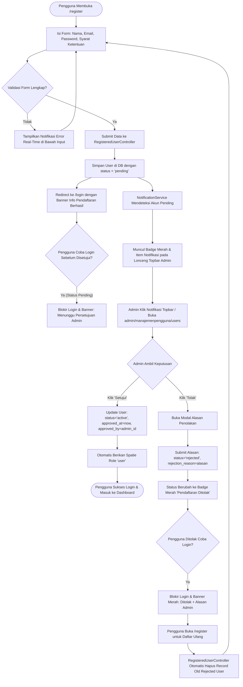

# Dokumentasi Alur Registrasi Mandiri & Persetujuan Akun Pengguna (Approval Workflow)

> **Status Sistem:** Production-Ready (Enterprise Grade)  
> **Lokasi File Dokumentasi:** `docs/alur_registrasi_dan_persetujuan_pengguna.md`  
> **Terakhir Diperbarui:** 28 Agustus 2026  

---

## 📋 1. Pendahuluan & Ringkasan Eksekutif

Sistem **Registrasi Mandiri dengan Alur Persetujuan Administrator (*User Approval & Rejection Workflow*)** dirancang untuk menjamin keamanan, integritas data, dan kontrol akses akun pada aplikasi dashboard. 

Berbeda dengan sistem registrasi konvensional yang langsung memberikan akses masuk setelah mendaftar, arsitektur ini menerapkan prinsip **Verifikasi Pra-Aktivasi (*Zero-Trust Onboarding*)**:
1. Pengguna baru dapat mendaftarkan diri secara mandiri melalui halaman registrasi publik (`/register`).
2. Akun yang baru terdaftar **tidak langsung aktif** dan ditandai dengan status `pending` (Menunggu Persetujuan).
3. Notifikasi pendaftaran baru secara *real-time* dikirimkan ke **Pusat Notifikasi Topbar Administrator**.
4. Superadmin atau Admin meninjau data pendaftar pada modul **Manajemen Pengguna** (`admin/manajemenpengguna/users`).
5. **Jika Disetujui:** Admin mengeklik tombol **"Setujui"**. Akun otomatis diaktifkan (`active`) dan diberikan hak akses peran Spatie **`user`** sehingga pengguna dapat login.
6. **Jika Ditolak:** Admin mengeklik tombol **"Tolak"** dan menginput alasan penolakan. Status akun diubah menjadi **`rejected`** (*Pendaftaran Ditolak*). Saat login, pengguna akan mendapatkan banner notifikasi lengkap berisi alasan penolakan dan diberikan kesempatan untuk mendaftar ulang.

---

## 🔄 2. Diagram Alur Kerja (Workflow Diagram)



---

## 🗄️ 3. Arsitektur Database & Schema Metadata

### 3.1 Perubahan Schema pada Tabel `users`
Implementasi status persetujuan dan penolakan didukung oleh migrasi database `2026_08_27_070000_add_status_and_approval_to_users_table.php` dan `2026_08_28_000003_add_rejection_reason_to_users_table.php`:

| Nama Kolom | Tipe Data | Nullable | Default | Keterangan |
| :--- | :--- | :--- | :--- | :--- |
| `status` | `VARCHAR(20)` | `NO` | `'active'` | Nilai: `'pending'`, `'active'`, `'inactive'`, `'rejected'` |
| `approved_at` | `TIMESTAMP` | `YES` | `NULL` | Waktu persetujuan akun oleh administrator |
| `approved_by` | `BIGINT (FK)` | `YES` | `NULL` | ID user administrator penanggung jawab yang menyetujui akun |
| `rejection_reason` | `TEXT` | `YES` | `NULL` | Catatan alasan penolakan pendaftaran oleh administrator |

### 3.2 Spatie Role Baku untuk Pendaftaran Mandiri
- **Nama Role:** `user`
- **Guard Name:** `web`
- **Akses Default:** Diberikan hak akses ke menu *Profil Pengguna* (`create profil-pengguna`, `read profil-pengguna`, `update profil-pengguna`) melalui seeder `MenuProfilPenggunaSeeder.php`.

---

## ⚙️ 4. Rincian Implementasi & Logika Teknis

### 4.1 Halaman Registrasi (`resources/views/auth/register.blade.php`)
- **Validasi Format Email Real-time:** Memeriksa keberadaan karakter `@` dan domain `.` sebelum submit, dengan pesan error ringkas: `"Format email tidak valid."`.
- **Toggle Visibility Password:** Tombol ikon mata (`ti ti-eye` / `ti ti-eye-off`) untuk melihat/menyembunyikan kata sandi.
- **Persetujuan Syarat & Ketentuan:** Checkbox *Agree the Terms & Policy* divalidasi ketat. Jika tidak dicentang, form submit dicegah dan menampilkan pesan error `"Anda wajib menyetujui syarat & ketentuan."`.
- **Autofocus Cerdas:** Jika terdapat error dari server (misal: email sudah terdaftar), kursor otomatis difokuskan ke kolom input yang bermasalah.

### 4.2 Controller Registrasi (`App\Http\Controllers\Auth\RegisteredUserController.php`)
```php
public function store(Request $request): RedirectResponse
{
    $request->validate([
        'name' => ['required', 'string', 'max:255'],
        'email' => ['required', 'string', 'lowercase', 'email', 'max:255', 'unique:'.User::class],
        'password' => ['required', 'string', Rules\Password::defaults()],
        'terms' => ['accepted'],
    ], [
        'name.required' => 'Nama lengkap wajib diisi.',
        'email.required' => 'Email wajib diisi.',
        'email.email' => 'Format email tidak valid.',
        'email.unique' => 'Email sudah terdaftar.',
        'password.required' => 'Password wajib diisi.',
        'terms.accepted' => 'Anda wajib menyetujui syarat & ketentuan.',
    ]);

    $user = User::create([
        'name' => $request->name,
        'email' => $request->email,
        'password' => Hash::make($request->password),
        'status' => 'pending', // Akun berstatus pending
    ]);

    event(new Registered($user));

    // Tanpa Auth::login() -> Dialihkan ke Login dengan pesan informasi
    return redirect()->route('login')->with(
        'registered_pending', 
        'Pendaftaran berhasil! Akun Anda telah terdaftar dan sedang menunggu persetujuan dari Administrator sebelum dapat digunakan.'
    );
}
```

### 4.3 Proteksi Login & Error Separation (`App\Http\Requests\Auth\LoginRequest.php`)
Logika otentikasi login memisahkan notifikasi kredensial salah dengan status persetujuan akun:
1. **Email Tidak Terdaftar:** Mengembalikan pesan `"User tidak terdaftar."` di bawah input email, kursor langsung fokus ke email, dan password yang diketik tidak hilang.
2. **Password Salah:** Mengembalikan pesan `"Password yang Anda masukkan salah."` di bawah input password, kursor langsung fokus ke password.
3. **Akun Belum Disetujui (`status = 'pending'`):** Mengembalikan validation key `unapproved` yang dirender sebagai **Banner Peringatan Khusus di Atas Form Login** (bukan di bawah email):
   > **Menunggu Persetujuan Admin**  
   > *"Akun Anda belum disetujui oleh Administrator. Silakan hubungi admin untuk aktivasi akun."*

### 4.4 Universal Notification Hub (`App\Services\NotificationService.php`)
Pusat notifikasi topbar dirancang sebagai *Hub Notifikasi Multi-Tipe*:
- Mengagregasi berbagai notifikasi sistem:
  - `registration`: Pendaftaran akun mandiri baru.
  - `deactivate_request`: Permintaan nonaktif user.
  - `reset_password_request`: Permintaan reset password.
  - `chat_message`: Notifikasi pesan/chat baru.
  - `system`: Notifikasi database internal Laravel.
- Ikon lonceng otomatis menampilkan badge counter merah beranimasi *pulse*.
- Mengarahkan admin secara instan dengan parameter pencarian URL:
  `route('admin.manajemenpengguna.users.index', ['search' => $user->name])`.

### 4.5 Modul Persetujuan Admin (`UserController.php` & `users.blade.php`)
- **Pencarian Otomatis:** Saat halaman Manajemen Pengguna menerima parameter `?search=...`, kolom pencarian otomatis terisi dan tabel langsung difilter.
- **Tombol "Setujui":** Tampil khusus untuk akun berstatus `pending`.
- **Eksekusi Persetujuan:**
```php
public function approve($id)
{
    $user = User::findOrFail($id);

    Role::firstOrCreate(['name' => 'user', 'guard_name' => 'web']);

    $user->update([
        'status' => 'active',
        'approved_at' => now(),
        'approved_by' => auth()->id(),
    ]);

    if ($user->roles->isEmpty()) {
        $user->assignRole('user');
    }

    app()[PermissionRegistrar::class]->forgetCachedPermissions();

    $this->notifySuccess("Akun pengguna \"{$user->name}\" berhasil disetujui & diaktifkan dengan Role User.");

    return redirect()->route('admin.manajemenpengguna.users.index');
}
```

- **Eksekusi Penolakan Pendaftaran Mandiri (`rejectRegistration`):**
```php
public function rejectRegistration(Request $request, $id)
{
    $user = User::findOrFail($id);
    $reason = trim($request->input('reason', 'Pendaftaran tidak disetujui oleh Administrator.'));

    $user->update([
        'status' => 'rejected',
        'rejection_reason' => $reason,
    ]);

    $this->notifySuccess("Pendaftaran pengguna \"{$user->name}\" berhasil ditolak.");

    return redirect()->route('admin.manajemenpengguna.users.index');
}
```

---

## 📖 5. Panduan Operasional

### 5.1 Untuk Pengguna Baru (Pendaftar Mandiri)
1. Buka halaman `/register`.
2. Masukkan Nama, Alamat Email, dan Kata Sandi.
3. Centang persetujuan syarat & kebijakan, lalu klik **Create Account**.
4. Sistem akan mengarahkan ke halaman login dengan pesan sukses.
5. Tunggu proses verifikasi dan persetujuan dari Administrator sebelum melakukan login.

### 5.2 Untuk Administrator / Superadmin
1. Masuk ke Dashboard Admin.
2. Perhatikan ikon **Lonceng Notifikasi** di bar atas (topbar). Jika terdapat badge merah, terdapat pendaftar yang menunggu persetujuan.
3. Klik ikon lonceng, lalu klik item pendaftar yang bersangkutan.
4. Sistem otomatis membuka menu **Manajemen Pengguna** dan menampilkan data pendaftar.
5. Klik tombol hijau **"Setujui"** pada baris pengguna dan konfirmasi pada dialog pop-up.
6. Akun seketika aktif dan notifikasi pendaftaran akan hilang secara otomatis.

---

## 🔑 6. Alur Permintaan Reset Password ke Administrator (Forgot Password Workflow)

Selain pendaftaran mandiri, sistem juga menerapkan alur **Permintaan Reset Kata Sandi Terverifikasi (*Admin-Assisted Password Reset*)**:

### 6.1 Alur Kerja Permintaan Reset:
1. **Pengajuan Pengguna (`/forgot-password`)**:
   - Pengguna memasukkan alamat email yang terdaftar.
   - Sistem memvalidasi keberadaan email di database. Jika tidak ada, mengembalikan pesan *"Email tidak terdaftar di sistem."*.
   - Jika terdaftar, sistem memperbarui timestamp `password_reset_requested_at` pada user dan mengarahkan ke `/login` dengan banner sukses hijau:
     > **Permintaan Reset Terkirim!**  
     > *"Permintaan reset password berhasil diajukan! Silakan menunggu proses reset kata sandi dari Administrator."*
2. **Notifikasi Topbar Administrator**:
   - Ikon lonceng topbar secara otomatis menampilkan badge dan item notifikasi berikon kunci (`ti ti-key` dengan badge *Minta Reset*).
   - Mengarahkan administrator langsung ke `admin/manajemenpengguna/users?search=NamaPengguna`.
3. **Eksekusi Reset oleh Administrator**:
   - Pada tabel Manajemen Pengguna, muncul badge biru `Minta Reset` dan tombol **"Reset Password"** (ikon `ti ti-key`).
   - Administrator mengonfirmasi dialog SweetAlert2: *"Reset password pengguna {Nama} ke password standar ('password*')?"*.
   - Password pengguna diubah menjadi hash `password*` dan timestamp `password_reset_requested_at` dibersihkan (`null`).
   - Notifikasi di lonceng topbar seketika hilang otomatis.

---

## 🔒 7. Standar Keamanan & Best Practices

1. **Pencegahan Akses Ilegal:** Akun berstatus `pending` atau `inactive` tidak akan pernah dapat menerobos proses login maupun endpoint otentikasi lainnya.
2. **Password Hashing:** Seluruh kata sandi di-hash menggunakan algoritma Bcrypt bawaan Laravel sebelum disimpan ke database.
3. **Audit Trail:** Kolom `approved_at` dan `approved_by` menyediakan rekam jejak akurat mengenai kapan dan siapa administrator yang mengesahkan aktivasi akun.
4. **CSRF & Rate Limiting:** Seluruh form registrasi, forgot password, dan persetujuan dilindungi oleh CSRF Token dan Throttle Rate Limiting untuk mencegah serangan *brute force* atau *spam*.

