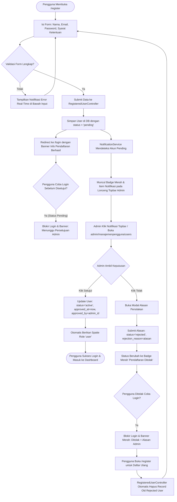
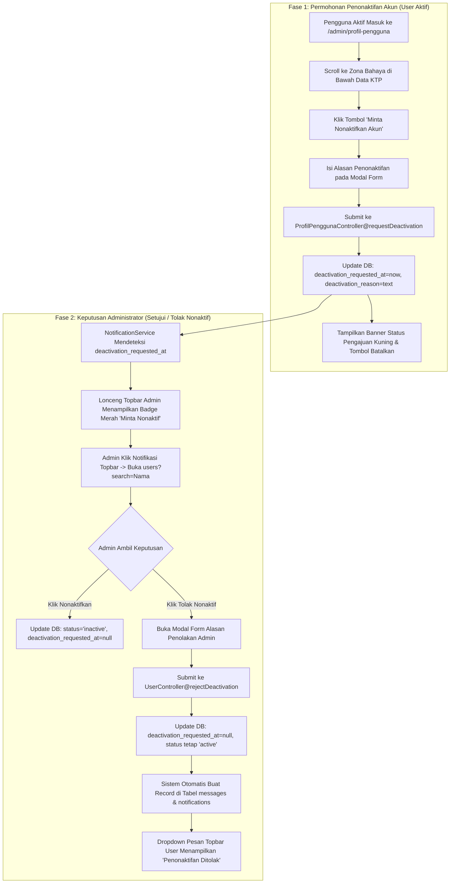

# 🔐 Dokumentasi Arsitektur & Operasional Autentikasi Pengguna (User Authentication & Lifecycle Management)

> **Status Sistem:** Production-Ready (Enterprise Grade Modular Architecture)  
> **Lokasi File Dokumentasi:** `docs/arsitektur_dan_operasional_authentication_user.md`  
> **Aplikasi:** REPALOGIC Dashboard  
> **Terakhir Diperbarui:** 04 September 2026 09:22 WIB  

---

## 📋 1. Pendahuluan & Ringkasan Eksekutif

Sistem **Autentikasi & Pengelolaan Siklus Hidup Akun Pengguna (*User Authentication & Lifecycle Management Engine*)** pada REPALOGIC Dashboard dirancang dengan prinsip **Keamanan Berlapis & Verifikasi Pra-Aktivasi (*Zero-Trust Onboarding & Admin-Assisted Lifecycle Control*)**.

Berbeda dengan sistem otentikasi standar yang langsung mengizinkan akses penuh begitu formulir pendaftaran diisi, arsitektur ini membagi siklus hidup akun pengguna ke dalam dua domain operasional utama:

1. **Domain 1: Registrasi Mandiri & Persetujuan Akun (*Self-Registration & Approval Workflow*)**:
   - Pengguna baru mendaftar secara mandiri melalui `/register`.
   - Akun baru berstatus `pending` (Menunggu Persetujuan) dan tidak dapat login.
   - Administrator menerima notifikasi real-time pada topbar untuk meninjau data.
   - **Disetujui:** Akun diubah ke `active` dan otomatis diberikan Spatie Role **`user`**.
   - **Ditolak:** Akun diubah ke `rejected` dengan alasan penolakan. Pengguna diblokir saat login dengan banner alasan penolakan dan dapat mendaftar ulang.

2. **Domain 2: Siklus Hidup Penonaktifan Mandiri & Aktivasi Kembali (*Account Deactivation & Reactivation*)**:
   - Pengguna aktif dapat mengajukan permohonan penonaktifan akun secara mandiri melalui menu **Profil Pengguna** (*Danger Zone*).
   - Pengajuan penonaktifan ditinjau oleh Administrator pada tabel **Manajemen Pengguna**:
     - **Disetujui Nonaktif:** Akun diubah ke `inactive` (Pengguna tidak dapat login).
     - **Ditolak Nonaktif:** Akun tetap `active`, dan sistem otomatis mengirimkan pesan alasan penolakan ke **Dropdown Pesan Topbar Pengguna**.
   - Akun berstatus `inactive` dapat mengajukan permohonan aktivasi kembali melalui halaman publik `/request-activation`.
   - Administrator memverifikasi dan mengaktifkan kembali akun melalui notifikasi badge hijau dan tombol persetujuan di panel admin.

---

## 🔄 2. Diagram Alur Kerja Terpadu (Comprehensive Workflows)

### 2.1 Alur Kerja Registrasi Mandiri, Persetujuan & Penolakan Akun

---

### 2.2 Alur Kerja Penonaktifan Mandiri & Aktivasi Kembali Akun

---

## 🛡️ 3. Keamanan, Rate Limiting & Proteksi Sesi

1. **Security Rate Limiting**:
   - Throttle key berdasarkan gabungan alamat IP dan email pengguna.
   - Otomatis melakukan *lockout* sementara jika batas maksimal kegagalan tercapai.
2. **Zero-Trust Session Invalidation**:
   - Ketika akun dinonaktifkan atau ditolak oleh Administrator, seluruh sesi aktif dari user target langsung diinvalidasi secara instan dari database/session store.
3. **Impersonation Safety**:
   - Fitur pergantian akun menyimpan sesi asli administrator di `session('admin_impersonator_id')` untuk menjamin kemudahan kembali (*switch-back*) tanpa merusak audit log.

---

> 📌 **Dokumentasi ini dikelola secara resmi oleh Tim Pengembang REPALOGIC Dashboard.**
