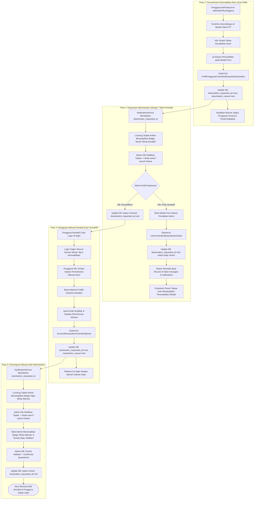

# 🔐 Dokumentasi Arsitektur & Operasional Autentikasi Pengguna (User Authentication & Lifecycle Management)

> **Status Sistem:** Production-Ready (Enterprise Grade)  
> **Lokasi File Dokumentasi:** `docs/arsitektur_dan_operasional_authentication_user.md`  
> **Aplikasi:** REPALOGIC Dashboard  
> **Terakhir Diperbarui:** 28 Agustus 2026  

---

## 📋 1. Pendahuluan & Ringkasan Eksekutif

Sistem **Autentikasi & Pengelolaan Siklus Hidup Akun Pengguna (*User Authentication & Lifecycle Management Engine*)** pada REPALOGIC Dashboard dirancang dengan prinsip **Keamanan Berlapis & Verifikasi Pra-Aktivasi (*Zero-Trust Onboarding & Admin-Assisted Lifecycle Control*)**.

Berbeda dengan sistem otentikasi standar yang langsung mengizinkan akses penuh begitu formulir pendaftaran diisi, arsitektur ini membagi siklus hidup akun pengguna ke dalam dua domain operasional utama:

1. **Domain 1: Registrasi Mandiri & Persetujuan Akun (*Self-Registration & Approval Workflow*)**:
   - Pengguna baru mendaftar secara mandiri melalui `/register`.
   - Akun baru berstatus `pending` (Menunggu Persetujuan) dan tidak dapat login.
   - Administrator menerima notifikasi real-time pada topbar untuk meninjau data.
   - **Disetujui:** Akun diubah ke `active` dan otomatis diberikan Spatie Role **`user`**.
   - **Ditolak:** Akun diubah ke `rejected` dengan alasan penolakan. Pengguna diblokir saat login dengan banner alasan penolakan dan dapat mendaftar ulang.

2. **Domain 2: Siklus Hidup Penonaktifan Mandiri & Aktivasi Kembali (*Account Deactivation & Reactivation*)**:
   - Pengguna aktif dapat mengajukan permohonan penonaktifan akun secara mandiri melalui menu **Profil Pengguna** (*Danger Zone*).
   - Pengajuan penonaktifan ditinjau oleh Administrator pada tabel **Manajemen Pengguna**:
     - **Disetujui Nonaktif:** Akun diubah ke `inactive` (Pengguna tidak dapat login).
     - **Ditolak Nonaktif:** Akun tetap `active`, dan sistem otomatis mengirimkan pesan alasan penolakan ke **Dropdown Pesan Topbar Pengguna**.
   - Akun berstatus `inactive` dapat mengajukan permohonan aktivasi kembali melalui halaman publik `/request-activation`.
   - Administrator memverifikasi dan mengaktifkan kembali akun melalui notifikasi badge hijau dan tombol persetujuan di panel admin.

---

## 🔄 2. Diagram Alur Kerja Terpadu (Comprehensive Workflows)

### 2.1 Alur Kerja Registrasi Mandiri, Persetujuan & Penolakan Akun


---

### 2.2 Alur Kerja Penonaktifan Mandiri & Aktivasi Kembali Akun



---

## 🗄️ 3. Arsitektur Database & Metadata Schema

Sistem autentikasi dan siklus hidup akun didukung oleh kolom-kolom status khusus pada tabel `users`:

### 3.1 Struktur Kolom Siklus Hidup pada Tabel `users`

| Nama Kolom | Tipe Data | Nullable | Default | Keterangan & Fungsi |
| :--- | :--- | :--- | :--- | :--- |
| `status` | `ENUM('pending', 'active', 'inactive', 'rejected')` | `NO` | `'active'` | Status operasional akun pengguna. |
| `approved_at` | `TIMESTAMP` | `YES` | `NULL` | Waktu persetujuan akun oleh administrator. |
| `approved_by` | `BIGINT UNSIGNED (FK)` | `YES` | `NULL` | ID user administrator yang menyetujui akun. |
| `rejection_reason` | `TEXT` | `YES` | `NULL` | Alasan penolakan pendaftaran akun oleh admin. |
| `deactivation_requested_at` | `TIMESTAMP` | `YES` | `NULL` | Waktu pengguna mengajukan permohonan penonaktifan akun. |
| `deactivation_reason` | `TEXT` | `YES` | `NULL` | Alasan penonaktifan yang diajukan oleh pengguna. |
| `reactivation_requested_at` | `TIMESTAMP` | `YES` | `NULL` | Waktu pengguna nonaktif mengajukan aktivasi kembali. |
| `reactivation_reason` | `TEXT` | `YES` | `NULL` | Alasan permohonan pengaktifan kembali akun. |

### 3.2 Spatie Role & Permission Baku
- **Role Otomatis:** `user` (diberikan saat akun disetujui).
- **Hak Akses Default:** Mengakses menu *Profil Pengguna* (`create profil-pengguna`, `read profil-pengguna`, `update profil-pengguna`) dan fitur pesan obrolan (`messages`).

---

## ⚙️ 4. Rincian Implementasi Logika Teknis

### 4.1 Registrasi Mandiri (`RegisteredUserController.php` & `register.blade.php`)
1. **Pendaftaran Akun Baru:**
   - Validasi ketat nama, format email unik, password terenkripsi (`Hash::make`), dan persetujuan syarat ketentuan (*Terms & Conditions*).
   - Akun disimpan dengan `status = 'pending'`.
   - Jika email yang didaftarkan sebelumnya berstatus `rejected`, sistem secara otomatis membersihkan rekam jejak lama agar pengguna dapat mendaftar ulang dengan data baru.
2. **Redirect & Feedback Pengguna:**
   - Dialihkan ke `/login` disertai session flash `registered_pending`.
   - Tidak melakukan *auto-login* sebelum disetujui Administrator.

### 4.2 Proteksi Login & Pemisahan Error (`LoginRequest.php` & `login.blade.php`)
Sistem memisahkan pesan kesalahan otentikasi berdasarkan kasus secara terisolasi:
1. **Email Tidak Terdaftar:** Menampilkan pesan `"User tidak terdaftar."` di bawah kolom email dan kursor otomatis fokus ke email.
2. **Password Salah:** Menampilkan pesan `"Password yang Anda masukkan salah."` di bawah kolom password.
3. **Akun Belum Disetujui (`status = 'pending'`):**
   - Mengembalikan validation key `unapproved`.
   - Dirender sebagai **Banner Peringatan Kuning/Biru di Atas Form Login**:
     > **Menunggu Persetujuan Admin**  
     > *"Akun Anda belum disetujui oleh Administrator. Silakan hubungi admin untuk aktivasi akun."*
4. **Akun Ditolak (`status = 'rejected'`):**
   - Mengembalikan validation key `rejected` beserta `rejection_reason`.
   - Dirender sebagai **Banner Peringatan Merah** lengkap dengan alasan penolakan dan tombol link menuju form pendaftaran ulang.
5. **Akun Dinonaktifkan (`status = 'inactive'`):**
   - Mengembalikan validation key `inactive`.
   - Dirender sebagai **Banner Peringatan Merah** dengan tombol tindakan langsung: **"Ajukan Permohonan Aktivasi Akun"** menuju `/request-activation`.

### 4.3 Persetujuan & Penolakan Registrasi oleh Administrator (`UserController.php`)
- **Persetujuan Akun (`approve`):**
  ```php
  public function approve($id)
  {
      $user = User::findOrFail($id);
      $user->update([
          'status' => 'active',
          'approved_at' => now(),
          'approved_by' => auth()->id(),
      ]);

      if (!$user->hasRole('user')) {
          $user->assignRole('user');
      }

      $this->notifySuccess("Akun {$user->name} berhasil disetujui dan diaktifkan.", 'Akun Diaktifkan');
      return redirect()->route('admin.manajemenpengguna.users.index');
  }
  ```
- **Penolakan Akun (`reject`):**
  ```php
  public function reject(Request $request, $id)
  {
      $user = User::findOrFail($id);
      $request->validate(['rejection_reason' => 'required|string|max:1000']);

      $user->update([
          'status' => 'rejected',
          'rejection_reason' => $request->input('rejection_reason'),
      ]);

      $this->notifySuccess("Pendaftaran akun {$user->name} berhasil ditolak.", 'Pendaftaran Ditolak');
      return redirect()->route('admin.manajemenpengguna.users.index');
  }
  ```

### 4.4 Pengajuan Penonaktifan Mandiri & Pembatalan (`ProfilPenggunaController.php`)
- Pengguna aktif dapat mengajukan penonaktifan melalui modal form pada zona bahaya profil.
- Selama pengajuan belum dieksekusi admin, pengguna dapat membatalkan pengajuan secara mandiri (*cancel deactivation*).
- Jika admin menolak penonaktifan (`rejectDeactivation`), status akun tetap `active`, dan sistem otomatis mengirimkan pesan penjelasan ke tabel `messages` yang muncul di dropdown pesan topbar pengguna.

### 4.5 Pengajuan Aktivasi Kembali Akun (`AccountReactivationController.php`)
- Pengguna yang dinonaktifkan mengisi email dan alasan permohonan pada form `/request-activation`.
- Kolom `reactivation_requested_at` dan `reactivation_reason` diperbarui.
- Lonceng topbar Administrator otomatis memunculkan badge hijau **"Minta Aktivasi"** yang mengarahkan langsung ke baris akun tersebut untuk dieksekusi.

---

## 🔔 5. Integrasi Universal Notification Hub (`NotificationService.php`)

Pusat notifikasi topbar mengagregasi seluruh aktivitas siklus hidup akun secara real-time:

| Tipe Notifikasi | Kondisi Pemicu | Badge & Warna | Target URL Admin |
| :--- | :--- | :---: | :--- |
| `registration` | Akun baru `status = 'pending'` | <span class="badge bg-danger text-white">Baru</span> | `admin/manajemenpengguna/users?search={name}` |
| `deactivate_request` | `deactivation_requested_at IS NOT NULL` | <span class="badge bg-danger text-white">Minta Nonaktif</span> | `admin/manajemenpengguna/users?search={name}` |
| `reactivate_request` | `reactivation_requested_at IS NOT NULL` | <span class="badge bg-success text-white">Minta Aktivasi</span> | `admin/manajemenpengguna/users?search={name}` |
| `chat_message` | Pesan obrolan masuk yang belum dibaca | <span class="badge bg-primary text-white">Pesan</span> | `admin/profil-pengguna/messages` |

---

## 📁 6. Daftar File & Komponen Terkait

| File Path | Deskripsi & Peran |
| :--- | :--- |
| `app/Http/Controllers/Auth/RegisteredUserController.php` | Controller pendaftaran mandiri pengguna baru. |
| `app/Http/Controllers/Auth/AuthenticatedSessionController.php` | Controller otentikasi login dan pembersihan sesi. |
| `app/Http/Controllers/Auth/AccountReactivationController.php` | Controller publik permohonan aktivasi akun nonaktif. |
| `app/Http/Requests/Auth/LoginRequest.php` | Validasi kredensial login & pemisahan error state. |
| `app/Http/Controllers/Admin/UserController.php` | Eksekusi approve, reject, deactivate, dan activate akun admin. |
| `app/Http/Controllers/Admin/ProfilPenggunaController.php` | Pengajuan dan pembatalan penonaktifan akun mandiri. |
| `app/Services/NotificationService.php` | Engine agregator notifikasi topbar real-time. |
| `resources/views/auth/register.blade.php` | Tampilan form pendaftaran mandiri. |
| `resources/views/auth/login.blade.php` | Tampilan form login dan banner pemisahan status akun. |
| `resources/views/auth/request-activation.blade.php` | Tampilan form publik pengajuan aktivasi akun. |
| `resources/views/admin/manajemenpengguna/users.blade.php` | Tampilan tabel manajemen pengguna & modal aksi persetujuan. |
| `docs/arsitektur_dan_operasional_authentication_user.md` | File dokumentasi arsitektur dan operasional ini. |
