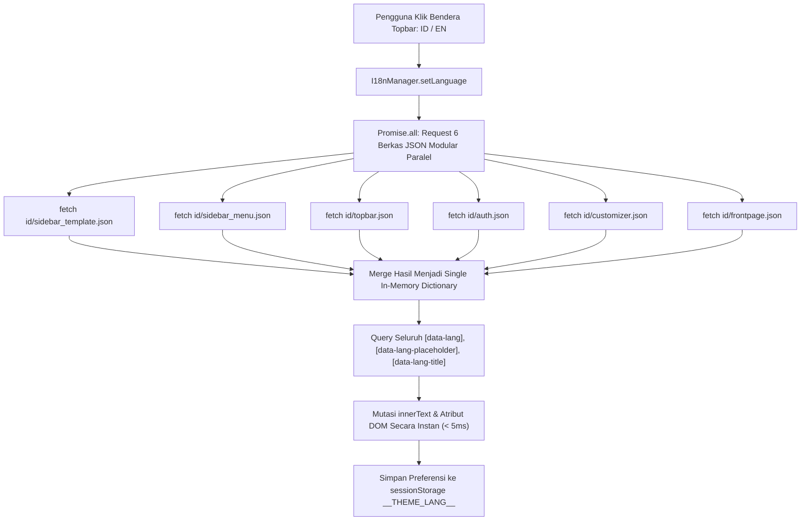

# 🌐 Dokumentasi Arsitektur & Operasional Sistem Bilingual (Modular Internationalization i18n)

> **Status Modul:** Production-Ready (Enterprise Grade Modular Architecture)  
> **Lokasi File Dokumentasi:** `docs/arsitektur_dan_operasional_bilingual.md`  
> **Route URL:** `/admin/dukunganaplikasi/translation`  
> **Controller:** [`App\Http\Controllers\Admin\DukunganAplikasi\TranslationController`](../app/Http/Controllers/Admin/DukunganAplikasi/TranslationController.php)  
> **Aset Terpisah (Rule 15):** [`public/assets/css/admin/dukunganaplikasi/translation.css`](../public/assets/css/admin/dukunganaplikasi/translation.css) & [`public/assets/js/admin/dukunganaplikasi/translation.js`](../public/assets/js/admin/dukunganaplikasi/translation.js)  
> **Direktori Kamus Modular:** `public/assets/data/translations/id/` & `public/assets/data/translations/en/`  
> **Terakhir Diperbarui:** 04 September 2026 09:22 WIB  

---

## 📋 1. Pendahuluan & Ringkasan Modul

Modul **Sistem Bilingual (*Modular Internationalization & Translation Engine*)** pada REPALOGIC Dashboard dirancang menggunakan pendekatan **Domain-Driven Modular Translation Dictionaries** dua arah (Bahasa Indonesia `ID` dan Bahasa Inggris `EN`).

Sistem ini memungkinkan alih bahasa antarmuka secara **100% dinamis dan instan tanpa reload halaman** (*zero page reload*) pada seluruh elemen navigasi sidebar, judul modul, header grup, dan label komponen dengan memanfaatkan pasangan **Atribut `data-lang`**, **Kamus JSON Terjemahan Modular**, serta **Pre-Hydration Anti-Flicker**.

```
┌─────────────────────────────────────────────────────────────────────────────────────────────────┐
│                           HUB MODULAR BILINGUAL & TERJEMAHAN i18n                               │
├────────────────────────────────┬────────────────────────────────┬───────────────────────────────┤
│ 1. 6 Domain Kamus Modular      │ 2. Parallel i18n Loader Engine │ 3. Auto-Sync Model Listener   │
│ (id/ & en/ Isolated JSONs)     │ (Promise.all Parallel Loading) │ (Menu::saved -> sidebar_menu) │
├────────────────────────────────┼────────────────────────────────┼───────────────────────────────┤
│ 4. Tab-Based Admin Manager     │ 5. Artisan CLI Code Scanner    │ 6. Anti-Flicker & Fallback    │
│ (Per-Domain GUI CRUD Manager)  │ (php artisan menu:lang-sync)   │ (sessionStorage Pre-Hydration)│
└────────────────────────────────┴────────────────────────────────┴───────────────────────────────┘
```

---

## 🏛️ 2. Arsitektur 6 Domain Kamus Modular

Kamus terjemahan tidak lagi disimpan dalam satu berkas monolitik besar, melainkan dipecah secara rapi ke dalam **6 Domain Kamus Terisolasi**:

```
public/assets/data/translations/
├── id/                                 # 🇮🇩 Kamus Bahasa Indonesia
│   ├── sidebar_template.json           # 1. Template bawaan (config/sidenav-template/*.php)
│   ├── sidebar_menu.json               # 2. Menu dinamis database / hasil input GUI Menu
│   ├── topbar.json                     # 3. Komponen Topbar, Notifikasi, Dropdown User
│   ├── auth.json                       # 4. Login, Register, Lock Screen, Reset Sandi
│   ├── customizer.json                 # 5. Theme Customizer, Layout Mode, Warna
│   └── frontpage.json                  # 6. Landing Page, Hero Banner, Seksi Website
├── en/                                 # 🇺🇸 Kamus Bahasa Inggris
│   ├── sidebar_template.json
│   ├── sidebar_menu.json
│   ├── topbar.json
│   ├── auth.json
│   ├── customizer.json
│   └── frontpage.json
├── id.json                             # Master auto-merged (backward compatibility)
└── en.json                             # Master auto-merged (backward compatibility)
```

### 📊 Rincian 6 Domain Kamus Terjemahan

| No | Modul / Domain | Berkas JSON | Sumber Data | Contoh Key Terjemahan |
| :---: | :--- | :--- | :--- | :--- |
| **1** | **Sidebar Template** | `sidebar_template.json` | `config/sidenav-template/*.php` | `apps-ecommerce-products`, `dashboards-crm`, `charts-apex` |
| **2** | **Sidebar Menu Dinamis** | `sidebar_menu.json` | Database (`menus` table) & GUI | `manajemen-pengguna`, `fitur-aplikasi`, `backup-db`, `menu` |
| **3** | **Topbar & Global UI** | `topbar.json` | Komponen bilah atas & header | `topbar-search`, `notifications`, `mark-all-read`, `profile` |
| **4** | **Autentikasi & Akun** | `auth.json` | Layar login, register, reset sandi | `login-title`, `remember-me`, `forgot-password`, `lock-screen` |
| **5** | **Admin Customizer** | `customizer.json` | Panel konfigurasi tema tampilan | `theme-mode`, `dark-mode`, `sidenav-size`, `topbar-color` |
| **6** | **Landing Page & Website** | `frontpage.json` | Halaman publik & landing section | `hero-title`, `get-started`, `contact-us`, `testimonials` |

---

## ⚡ 3. Alur Kerja Parallel Loader Engine (`I18nManager` di `app.js`)

Saat pengguna berpindah bahasa pada dropdown Topbar, sistem mengeksekusi pemuatan paralel menggunakan `Promise.allSettled`:



### Cuplikan Implementasi Loader di [`public/assets/js/app.js`](../public/assets/js/app.js):
```javascript
async loadTranslations() {
    try {
        let p = this.langPath.startsWith('/') || this.langPath.startsWith('http') ? this.langPath : '/' + this.langPath;
        if (!p.endsWith('/')) p += '/';
        const modules = ['sidebar_template', 'sidebar_menu', 'topbar', 'auth', 'customizer', 'frontpage'];
        const results = await Promise.allSettled(
            modules.map(k => fetch(`${p}${this.selectedLanguage}/${k}.json?v=${Date.now()}`).then(res => res.ok ? res.json() : {}))
        );
        let merged = {};
        results.forEach(res => {
            if (res.status === 'fulfilled' && typeof res.value === 'object' && res.value !== null) {
                Object.assign(merged, res.value);
            }
        });
        // Fallback graceful ke root JSON jika modular kosong
        if (Object.keys(merged).length === 0) {
            try {
                let fb = await fetch(`${p}${this.selectedLanguage}.json?v=${Date.now()}`);
                if (fb.ok) merged = await fb.json();
            } catch (err) {}
        }
        return merged;
    } catch (e) {
        return console.error('Translation load error:', e), {};
    }
}
```

---

## ⚙️ 4. Arsitektur Backend & Manajemen Terjemahan Berbasis Tab

Seluruh operasi manajemen kamus bahasa dikendalikan oleh Controller [`TranslationController.php`](../app/Http/Controllers/Admin/DukunganAplikasi/TranslationController.php).

### 4.1 Daftar Endpoint API Modul

| HTTP Method | Route URI | Nama Route | Fungsi & Deskripsi |
| :---: | :--- | :--- | :--- |
| `GET` | `/admin/dukunganaplikasi/translation` | `admin.dukunganaplikasi.translation.index` | Menampilkan tabel terjemahan modular dengan filter Nav Pills Tab per domain. |
| `POST` | `/admin/dukunganaplikasi/translation` | `admin.dukunganaplikasi.translation.store` | Menambahkan key terjemahan ke domain modular spesifik (`id/{module}.json` & `en/{module}.json`). |
| `PUT / PATCH` | `/admin/dukunganaplikasi/translation/{key}` | `admin.dukunganaplikasi.translation.update` | Memperbarui nama key atau nilai teks terjemahan ID & EN pada modul bersangkutan. |
| `DELETE` | `/admin/dukunganaplikasi/translation/{key}` | `admin.dukunganaplikasi.translation.destroy` | Menghapus key terjemahan dari domain modular bersangkutan. |

### 4.2 Auto-Sync Model Hook ([`Menu.php`](../app/Models/Admin/DukunganAplikasi/Menu.php))

Ketika menu baru ditambahkan atau diubah di database, sistem secara otomatis mengeksekusi `Menu::syncTranslationKey()` yang menulis **hanya** ke `sidebar_menu.json` dan menyinkronkan master root file:

```php
// app/Models/Admin/DukunganAplikasi/Menu.php
public static function syncTranslationKey(Menu $menu): void
{
    $dataLang = $menu->data_lang ?: Str::slug($menu->name);
    if (empty($dataLang)) return;

    // Menulis khusus ke modular sidebar_menu.json
    $idModularPath = public_path('assets/data/translations/id/sidebar_menu.json');
    $enModularPath = public_path('assets/data/translations/en/sidebar_menu.json');
    // ... update & ksort data
}
```

---

## 🖥️ 5. Antarmuka Pengguna Admin (Tab Navigation & Event Delegation)

Halaman [`translation.blade.php`](../resources/views/admin/dukunganaplikasi/translation.blade.php) didukung oleh aset terpisah:
- **CSS:** [`public/assets/css/admin/dukunganaplikasi/translation.css`](../public/assets/css/admin/dukunganaplikasi/translation.css)
- **JS:** [`public/assets/js/admin/dukunganaplikasi/translation.js`](../public/assets/js/admin/dukunganaplikasi/translation.js)

Dilengkapi:
1. **Modular Tab Pills Bar**: Filter instan antar domain modul (*Semua*, *Sidebar Menu*, *Sidebar Template*, *Topbar*, *Auth*, *Customizer*, *Landing Page*) tanpa reload halaman melalui URL History Sync.
2. **Standard Thead Single-Line**: Mematuhi Rule 8 (`align-middle text-center text-nowrap`).
3. **Form Modal Cerdas**: Dropdown `Modul / Domain Terjemahan` yang otomatis terisi sesuai Tab yang sedang aktif saat tombol *Tambah* ditekan.
4. **Universal SweetAlert2 Integration**: Konfirmasi penghapusan aman menggunakan helper global Rule 9.

---

## 📑 6. Panduan Praktis Menambah & Mengelola Terjemahan

### A. Menambahkan Terjemahan Menu Aplikasi Baru:
1. Buka **Dukungan Aplikasi > Terjemahan Bahasa** (`/admin/dukunganaplikasi/translation`).
2. Pilih Tab **🧭 Sidebar: Menu Dinamis**.
3. Klik **`+ Tambah Key Terjemahan`** (Domain otomatis terisi *Sidebar: Menu Dinamis*).
4. Masukkan **Key Terjemahan (Slug)** (misal: `laporan-harian`).
5. Masukkan teks **Bahasa Indonesia (ID)** & **Bahasa Inggris (EN)**.
6. Simpan. Key langsung tersimpan di `id/sidebar_menu.json` & `en/sidebar_menu.json`!

### B. Menambahkan Terjemahan Label Autentikasi / Topbar:
1. Pilih Tab **🔐 Autentikasi & Akun** atau **🔔 Topbar**.
2. Klik **`+ Tambah Key Terjemahan`**.
3. Masukkan key dan teks terjemahan ID/EN.
4. Pada elemen Blade, cukup sematkan atribut: `<span data-lang="key-anda">Teks Default</span>`.

---

> 📌 **Dokumentasi ini dikelola secara resmi oleh Tim Pengembang REPALOGIC Dashboard.**  
> *Sistem Bilingual telah sepenuhnya termodularisasi dan siap digunakan untuk kebutuhan multi-bahasa skala enterprise.*
