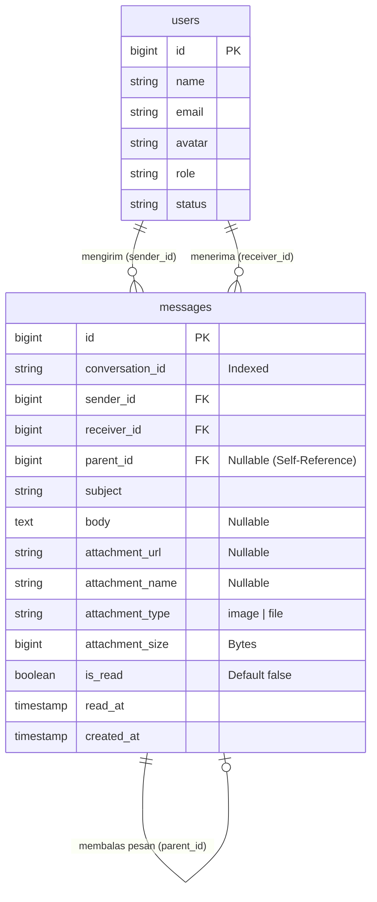
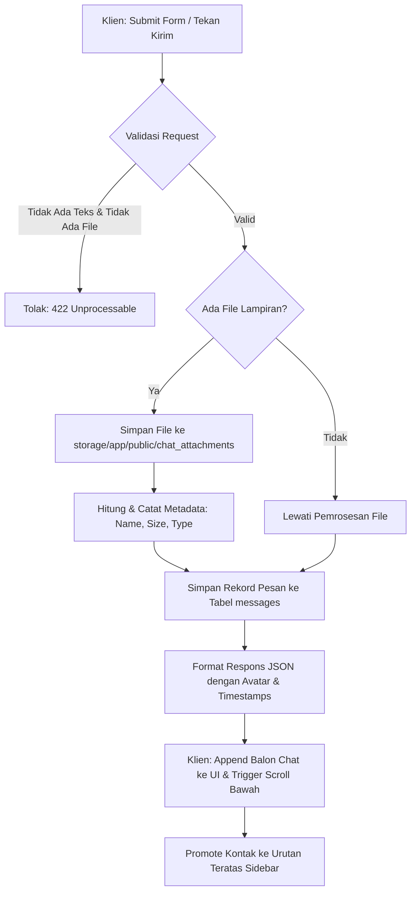
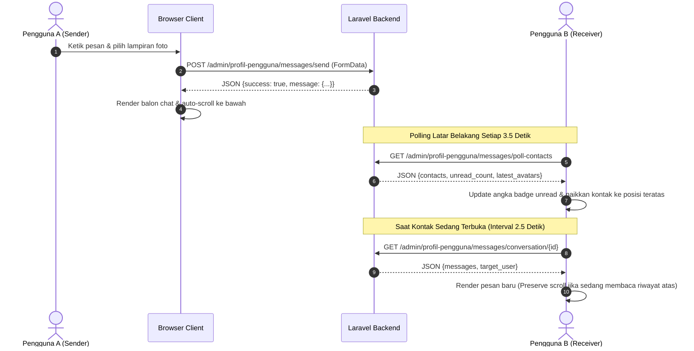

# 💬 Dokumentasi Pola & Operasional Fitur Chat / Pesan (Messages Engine)

> **Status Modul:** Production-Ready (Enterprise Grade)  
> **Lokasi File Dokumentasi:** `docs/arsitektur_dan_operasional_fitur_chat_messages.md`  
> **Route URL:** `/admin/profil-pengguna/messages`  
> **Versi Rilis:** `v2.3.5`  
> **Terakhir Diperbarui:** 28 Agustus 2026 16:42 WIB  

---

## 📋 1. Pendahuluan & Ringkasan Modul

Modul **Chat & Direct Messaging** pada REPALOGIC Dashboard dirancang sebagai pusat komunikasi real-time antar-pengguna internal (Admin, Superadmin, Staff, dan User). Sistem ini memungkinkan pertukaran pesan langsung secara aman, terorganisir, dan responsif dengan antarmuka modern yang menyerupai aplikasi perpesanan enterprise instan.

Fitur-fitur utama yang didukung oleh engine ini meliputi:
1. **Percakapan Dua Arah (*1-on-1 Direct Chat*)** dengan penandaan ID percakapan deterministik.
2. **Kutipan Balasan Pesan (*Interactive Quoted Reply*)** yang merujuk pada pesan sebelumnya.
3. **Pemilih Emoji Interaktif (*Rich Emoji & Emotion Picker*)** multi-kategori dengan pencarian kata kunci dan *quick reaction bar*.
4. **Pengiriman Lampiran Foto & Dokumen (*Image & File Attachment*)** dengan validasi ukuran hingga 10 MB, *live pre-upload preview bar*, dan *high-resolution lightbox modal*.
5. **Sinkronisasi Real-Time (*Background Polling Engine*)** untuk pesan baru, *unread badge counter*, promosi kontak sidebar, dan pembaruan foto profil avatar instan tanpa reload halaman.
6. **Jembatan Hub Pesan Terpadu (*Message Hub Bridge*)** yang terintegrasi langsung dengan lonceng notifikasi dan *topbar message dropdown*.

---

## 🏛️ 2. Arsitektur Database & Skema Data

Sistem percakapan menggunakan satu tabel inti `messages` dengan dukungan relasi rekursif untuk fitur balasan (*reply quote*) dan penyimpanan metadata lampiran.

### 2.1 Skema Tabel `messages`

| Kolom | Tipe Data | Keterangan & Atribut |
| :--- | :--- | :--- |
| `id` | `BIGINT UNSIGNED` | Primary Key, Auto Increment |
| `conversation_id` | `VARCHAR(100)` | Indeks deterministik percakapan (format: `{min_id}_{max_id}`) |
| `sender_id` | `BIGINT UNSIGNED` | Foreign Key ke `users.id` (Pengirim) |
| `receiver_id` | `BIGINT UNSIGNED` | Foreign Key ke `users.id` (Penerima) |
| `parent_id` | `BIGINT UNSIGNED` | Nullable, Foreign Key ke `messages.id` (Relasi Pesan Balasan) |
| `subject` | `VARCHAR(255)` | Subjek atau konteks pesan (misal: "Pesan Masuk", "Aktivasi Akun") |
| `body` | `TEXT` | Nullable, isi teks pesan obrolan |
| `reason` | `TEXT` | Nullable, catatan/alasan khusus dari admin (jika ada) |
| `message_type` | `VARCHAR(50)` | Default `'chat'`, tipe pesan (`chat`, `notification`, `rejection`, dll) |
| `attachment_url` | `VARCHAR(255)` | Nullable, path/URL file yang diunggah ke storage publik |
| `attachment_name`| `VARCHAR(255)` | Nullable, nama asli berkas yang diunggah pengguna |
| `attachment_type`| `VARCHAR(50)`  | Nullable, klasifikasi tipe berkas (`image` atau `file`) |
| `attachment_size`| `BIGINT UNSIGNED` | Nullable, ukuran berkas dalam satuan *bytes* |
| `is_read` | `BOOLEAN` | Default `false`, status telah dibaca oleh penerima |
| `read_at` | `TIMESTAMP` | Nullable, waktu presisi ketika pesan dibaca |
| `created_at` / `updated_at` | `TIMESTAMP` | Timestamps bawaan Eloquent |

### 2.2 Pola Pembuatan `conversation_id` (Deterministik)

Untuk memastikan bahwa pesan antara User A dan User B selalu berada dalam satu wadah percakapan yang sama tanpa bergantung pada siapa yang memulai obrolan terlebih dahulu, ID percakapan digenerasi menggunakan formula:

```text
conversation_id = min(user_1, user_2) . '_' . max(user_1, user_2)
```

```php
// app/Models/Message.php
public static function makeConversationId(int $user1, int $user2): string
{
    return min($user1, $user2) . '_' . max($user1, $user2);
}
```

### 2.3 Diagram Relasi Entitas (ERD)



---

## ⚙️ 3. Pola Desain Backend & Endpoint API (`MessageController`)

Seluruh logika operasional chat dikendalikan oleh Controller tunggal [`MessageController.php`](file:///F:/laragon/finaly/repalogic-dashboard/app/Http/Controllers/Admin/MessageController.php).

### 3.1 Endpoint & Routing

| HTTP Method | Route URI | Nama Route | Fungsi & Deskripsi |
| :---: | :--- | :--- | :--- |
| `GET` | `/admin/profil-pengguna/messages` | `admin.profil-pengguna.messages.index` | Merender view Blade utama, membagi kontak sidebar, dan memuat percakapan default. |
| `GET` | `/admin/profil-pengguna/messages/poll-contacts` | `admin.profil-pengguna.messages.poll-contacts` | Background poller untuk daftar kontak, unread counter, dan avatar terbaru. |
| `GET` | `/admin/profil-pengguna/messages/conversation/{user}` | `admin.profil-pengguna.messages.conversation` | Mengambil seluruh pesan obrolan dengan user target dan menandainya sebagai sudah dibaca (`is_read = true`). |
| `POST` | `/admin/profil-pengguna/messages/send` | `admin.profil-pengguna.messages.send` | Menerima pengiriman pesan teks, balasan quote, dan upload lampiran via `FormData`. |

### 3.2 Alur Pemrosesan Pengiriman Pesan (`send`)



---

## 🖥️ 4. Pola Desain Frontend & Komponen Interaktif (`messages.blade.php`)

Antarmuka chat pada [`messages.blade.php`](file:///F:/laragon/finaly/repalogic-dashboard/resources/views/admin/profil-pengguna/messages.blade.php) dibangun secara modular menggunakan Bootstrap 5 dan Javascript Vanilla yang mematuhi seluruh Project Rules.

### 4.1 Struktur Tata Letak 2-Kolom

1. **Sidebar Kiri (Daftar Kontak & Pencarian)**:
   - **Pencarian Live**: Input `#chat-contact-search` memfilter daftar kontak secara instan berdasarkan nama pengguna.
   - **Percakapan Aktif (*Recent Contacts*)**: Menampilkan daftar kontak yang pernah berinteraksi sebelumnya, diurutkan berdasarkan pesan terbaru lengkap dengan cuplikan pesan terakhir dan badge pesan belum dibaca (*unread counter*).
   - **Pengguna Lainnya (*Other Contacts*)**: Menampilkan daftar akun terdaftar yang belum memiliki riwayat obrolan dengan akun yang login.

2. **Main Canvas Kanan (Area Percakapan)**:
   - **Header Obrolan**: Menampilkan avatar foto profil aktif (ukuran 42x42px dengan margin yang lega), nama pengguna, status koneksi aktif, badge role pengguna, dan tombol akses **Detail Akun Modal** (`#user-detail-modal`).
   - **Container Riwayat Obrolan (`#chat-container`)**: Didukung oleh engine scroll *SimpleBar* (`.simplebar-content`) untuk scrolling mulus tanpa merusak tata letak tema.
   - **Footer Bar Input**:
     - Kolom teks pesan (`#chat-message-input`).
     - Bar Pratinjau Balasan (*Reply Preview Container*).
     - Bar Pratinjau Lampiran (*Attachment Preview Container*).
     - Tombol Pemilih Emoji (`#btn-toggle-emoji`).
     - Tombol Unggah Berkas & Foto (`#btn-attach-file` dan `#chat-file-input`).
     - Tombol Kirim Pesan (`#btn-send-message`).

### 4.2 Desain Balon Obrolan (*Chat Bubble*) Multi-Format

- **Pesan Teks Biasa**: Dirender dengan latar belakang `bg-primary-subtle` (untuk pengirim/kanan) dan `bg-light border` (untuk lawan bicara/kiri) dengan sanitasi teks anti-XSS (`escapeHtml` dan `nl2br`).
- **Pesan Balasan (*Quoted Reply*)**: Menampilkan kotak kutipan kecil bergaris aksen biru di sisi kiri (`border-start border-3 border-primary`), menampilkan nama pengirim pesan asli dan teks cuplikannya.
- **Lampiran Gambar / Foto**: Ditampilkan sebagai kartu foto berbingkai dengan efek zoom transisi halus saat kursor diarahkan (*hover*). Saat gambar diklik, modal lightbox resolusi tinggi (`#chat-image-modal`) akan terbuka dengan opsi unduh resolusi asli.
- **Lampiran Dokumen**: Ditampilkan sebagai kartu download berikon representatif (PDF, Word, Excel, ZIP, atau Text) dengan indikator nama dan ukuran berkas (KB/MB) serta tombol unduh langsung.

---

## 🔄 5. Mekanisme Operasional & Real-Time Synchronization

Sistem obrolan menggunakan arsitektur polling asinkron yang ringan (*lightweight background polling*) untuk menjamin sinkronisasi data tanpa memerlukan instalasi server WebSocket eksternal yang rumit.



### 5.1 Smart Scroll Preservation Engine
Saat riwayat pesan diperbarui melalui polling latar belakang, sistem memeriksa posisi scroll pengguna (`isUserNearBottom()`). Jika pengguna sedang membaca pesan lama di bagian atas (`scrollTop > 120px` dari bawah), sistem **TIDAK AKAN** memaksa scroll ke bawah secara otomatis agar kenyamanan membaca tidak terganggu.

### 5.2 Real-Time Avatar Sync Engine
Di setiap siklus polling, sistem membandingkan URL foto profil terbaru (`avatar_url`) dari backend dengan state DOM klien:
- Jika lawan bicara mengganti foto profil, gambar di kontak sidebar, header obrolan aktif, modal detail pengguna, dan seluruh balon obrolan lawan bicara (`.chat-avatar-opponent`) langsung diperbarui secara instan.
- Jika pengguna sendiri mengganti foto profil di tab lain, seluruh balon chat pengirim (`.chat-avatar-sender`) dan dropdown avatar topbar langsung diperbarui secara serentak.

---

## 🛡️ 6. Standar Keamanan & Validasi Sistem

1. **Proteksi Unggah Berkas**:
   - Tipe berkas yang diizinkan dibatasi ketat pada ekstensi: `jpg, jpeg, png, webp, gif, pdf, doc, docx, xls, xlsx, zip, rar, txt`.
   - Batas maksimum ukuran berkas adalah **10 MB** (10240 KB), divalidasi ganda baik di sisi JavaScript klien (*early validation*) maupun di level Form Validation Controller backend.
2. **Pencegahan Cross-Site Scripting (XSS)**:
   - Seluruh teks pesan dan nama pengirim yang dirender secara dinamis melalui JavaScript diproses menggunakan fungsi `escapeHtml()` sebelum diinjeksikan ke dalam DOM.
3. **Isolasi Akses Percakapan**:
   - Pengambilan riwayat percakapan (`getMessages`) memvalidasi kepemilikan percakapan berdasarkan `conversation_id` yang hanya melibatkan `auth()->id()` dan target user.

---

## 📁 7. Daftar File & Komponen Terkait

| File Path | Peran & Tanggung Jawab |
| :--- | :--- |
| `app/Http/Controllers/Admin/MessageController.php` | Controller utama pengelola endpoint chat, polling, dan pengiriman pesan/file. |
| `app/Models/Message.php` | Eloquent Model pesan, relasi sender/receiver/parent, dan generator `conversation_id`. |
| `database/migrations/2026_08_28_000006_add_attachment_meta_to_messages_table.php` | Migrasi metadata lampiran berkas dan nullability `body`. |
| `resources/views/admin/profil-pengguna/messages.blade.php` | View utama modul chat, script polling, emoji picker, attachment bar & modal lightbox. |
| `resources/views/layouts/partials/topbar.blade.php` | Dropdown notifikasi pesan topbar yang tersinkronisasi dengan message hub. |
| `docs/riwayat_release_dan_tag.md` | Catatan riwayat versi dan tag rilis proyek. |
| `docs/arsitektur_dan_operasional_fitur_chat_messages.md` | File dokumentasi arsitektur dan operasional ini. |
