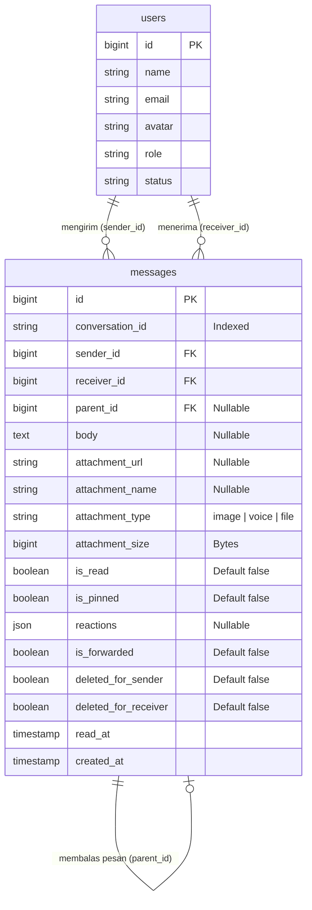
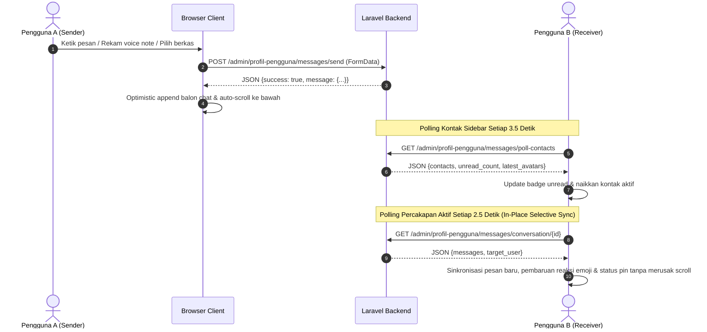

# 💬 Dokumentasi Pola & Operasional Fitur Chat / Pesan (Messages Engine)

> **Status Modul:** Production-Ready (Enterprise Grade Modular Architecture)  
> **Lokasi File Dokumentasi:** `docs/arsitektur_dan_operasional_fitur_chat_messages.md`  
> **Route URL:** `/admin/profil-pengguna/messages`  
> **Controller:** [`App\Http\Controllers\Admin\MessageController`](../app/Http/Controllers/Admin/MessageController.php)  
> **Aset Terpisah (Rule 15):** [`public/assets/css/admin/profil-pengguna/messages.css`](../public/assets/css/admin/profil-pengguna/messages.css) & [`public/assets/js/admin/profil-pengguna/messages.js`](../public/assets/js/admin/profil-pengguna/messages.js)  
> **Terakhir Diperbarui:** 04 September 2026 09:22 WIB  

---

## 📋 1. Pendahuluan & Ringkasan Modul

Modul **Chat & Direct Messaging** pada REPALOGIC Dashboard dirancang sebagai pusat komunikasi real-time antar-pengguna internal (Superadmin, Admin, Operator, dan User). Sistem ini memungkinkan pertukaran pesan langsung secara aman, terorganisir, dan responsif dengan antarmuka modern yang menyerupai aplikasi perpesanan enterprise instan.

```
┌─────────────────────────────────────────────────────────────────────────────────────────────────┐
│                             ENGINE FITUR CHAT & DIRECT MESSAGING                                │
├────────────────────────────────┬────────────────────────────────┬───────────────────────────────┤
│ 1. 1-on-1 Direct Chat & Voice  │ 2. Quoted Reply & Forwarding   │ 3. Pinned Messages Hub        │
│ (Deterministik ID & Voice Note)│ (Parent Relasi & Multi-Target) │ (Penyematan Pesan Penting)    │
├────────────────────────────────┼────────────────────────────────┼───────────────────────────────┤
│ 4. Emoji Picker & Reactions    │ 5. 3-Dots Action Dropdown Menu │ 6. Dual-Mode Deletion & Clear │
│ (Inline Clean Reaction Bar)    │ (Balas, Teruskan, Pin, Hapus)  │ (Unsend vs Delete For Me)     │
└────────────────────────────────┴────────────────────────────────┴───────────────────────────────┘
```

### 🌟 Fitur-Fitur Utama yang Didukung:
1. **Percakapan Dua Arah (*1-on-1 Direct Chat*)**: Menggunakan formula penandaan `conversation_id` deterministik (`min_id . '_' . max_id`).
2. **Perekam & Pemutar Pesan Suara (*Voice Note Audio Engine*)**: Perekaman audio langsung dari mikrofon peramban dengan timer durasi real-time, visualisasi bar audio, dan pemutar suara interaktif.
3. **Menu Aksi Titik Tiga (*3-Dots Action Dropdown*) pada Bubble Chat**: Tombol melayang di sudut bubble (kanan atas untuk pesan sendiri, kiri atas untuk lawan bicara) yang mengemas aksi *Balas*, *Teruskan*, *Pin / Lepas Pin*, dan *Hapus Pesan*.
4. **Reaksi Emoji Bersih Sejajar (*Inline Clean Emoji Reactions*)**: Tombol reaksi emoji cepat dengan hasil reaksi yang tampil sejajar langsung di samping tombol reaksi (tanpa badge/border berlebih). Dilengkapi sinkronisasi in-place real-time saat polling.
5. **Kutipan Balasan Pesan (*Interactive Quoted Reply*)**: Mengutip pesan sebelumnya dengan pratinjau kotak kutipan bergaris aksen biru dan navigasi scroll otomatis menuju pesan asal.
6. **Penyematan Pesan (*Pinned Messages*)**: Menyematkan pesan penting di bagian atas area obrolan dengan banner pin interaktif untuk melompat langsung ke pesan bersangkutan.
7. **Penerusan Pesan (*Message Forwarding*)**: Meneruskan pesan teks atau lampiran berkas ke pengguna lain melalui modal daftar kontak.
8. **Pencarian Riwayat Obrolan (*In-Chat Search & Highlighting*)**: Mencari kata kunci dalam percakapan aktif dengan navigasi panah atas/bawah dan counter kecocokan kata.
9. **Penghapusan Pesan Ganda (*Dual-Mode Deletion*)**: Pilihan antara *Tarik Pesan untuk Semua Orang (Unsend)* jika dihapus oleh pengirim atau *Hapus untuk Saya Sendiri* jika dihapus oleh penerima.
10. **Pembersihan Riwayat Percakapan (*Clear Conversation History*)**: Menghapus seluruh pesan dari sudut pandang pengguna aktif tanpa merusak riwayat pada akun lawan bicara.
11. **Pengiriman Lampiran Foto & Dokumen (*Image & File Attachment*)**: Validasi hingga 10 MB dengan *live pre-upload preview bar* dan *high-resolution lightbox modal*.
12. **Sinkronisasi Real-Time Tanpa Kedipan (*In-Place Polling Engine*)**: Pembaruan pesan, reaksi emoji, status pin, unread badge counter, promosi kontak sidebar, dan avatar secara instan tanpa mengganggu scroll pembaca atau pemutaran audio.

---

## 🏛️ 2. Arsitektur Database & Skema Data

Sistem percakapan menggunakan tabel inti `messages` dengan dukungan relasi rekursif untuk fitur balasan (*reply quote*) dan penyimpanan metadata lampiran serta interaksi sosial.

### 2.1 Skema Tabel `messages`

| Kolom | Tipe Data | Keterangan & Atribut |
| :--- | :--- | :--- |
| `id` | `BIGINT UNSIGNED` | Primary Key, Auto Increment |
| `conversation_id` | `VARCHAR(100)` | Indeks deterministik percakapan (format: `{min_id}_{max_id}`) |
| `sender_id` | `BIGINT UNSIGNED` | Foreign Key ke `users.id` (Pengirim) |
| `receiver_id` | `BIGINT UNSIGNED` | Foreign Key ke `users.id` (Penerima) |
| `parent_id` | `BIGINT UNSIGNED` | Nullable, Foreign Key ke `messages.id` (Relasi Pesan Balasan) |
| `subject` | `VARCHAR(255)` | Subjek atau konteks pesan (misal: "Pesan Masuk", "Aktivasi Akun") |
| `body` | `TEXT` | Nullable, isi teks pesan obrolan |
| `reason` | `TEXT` | Nullable, catatan/alasan khusus dari admin (jika ada) |
| `message_type` | `VARCHAR(50)` | Default `'direct'`, tipe pesan (`direct`, `chat`, `notification`, dll) |
| `attachment_url` | `VARCHAR(255)` | Nullable, path/URL file yang diunggah ke storage publik |
| `attachment_name`| `VARCHAR(255)` | Nullable, nama asli berkas yang diunggah pengguna |
| `attachment_type`| `VARCHAR(50)`  | Nullable, klasifikasi tipe berkas (`image`, `voice`, atau `file`) |
| `attachment_size`| `BIGINT UNSIGNED` | Nullable, ukuran berkas dalam satuan *bytes* |
| `is_read` | `BOOLEAN` | Default `false`, status telah dibaca oleh penerima |
| `read_at` | `TIMESTAMP` | Nullable, waktu presisi ketika pesan dibaca |
| `is_pinned` | `BOOLEAN` | Default `false`, penanda apakah pesan disematkan di percakapan |
| `reactions` | `JSON` | Nullable, array asosiatif emoji dan daftar `user_id` pemberi reaksi |
| `is_forwarded` | `BOOLEAN` | Default `false`, penanda bahwa pesan merupakan hasil terusan |
| `deleted_for_sender` | `BOOLEAN` | Default `false`, status dihapus khusus dari sudut pandang pengirim |
| `deleted_for_receiver`| `BOOLEAN` | Default `false`, status dihapus khusus dari sudut pandang penerima |
| `created_at` / `updated_at` | `TIMESTAMP` | Timestamps bawaan Eloquent |

### 2.2 Pola Pembuatan `conversation_id` (Deterministik)

```php
// app/Models/Message.php
public static function makeConversationId(int $user1, int $user2): string
{
    return min($user1, $user2) . '_' . max($user1, $user2);
}
```

### 2.3 Diagram Relasi Entitas (ERD)



---

## ⚙️ 3. Endpoint API & Routing Controller (`MessageController`)

Seluruh endpoint chat dikendalikan oleh [`MessageController.php`](../app/Http/Controllers/Admin/MessageController.php):

| HTTP Method | Route URI | Nama Route | Fungsi & Deskripsi |
| :---: | :--- | :--- | :--- |
| `GET` | `/admin/profil-pengguna/messages` | `admin.profil-pengguna.messages.index` | Menampilkan antarmuka chat 2-kolom, memuat kontak, dan percakapan default. |
| `GET` | `/admin/profil-pengguna/messages/poll-contacts` | `admin.profil-pengguna.messages.poll-contacts` | Background poller untuk daftar kontak sidebar, unread badge counter, dan avatar terbaru. |
| `GET` | `/admin/profil-pengguna/messages/conversation/{user}` | `admin.profil-pengguna.messages.conversation` | Mengambil seluruh pesan obrolan aktif dengan target user dan menandai pesan sebagai terbaca (`is_read = true`). |
| `POST` | `/admin/profil-pengguna/messages/send` | `admin.profil-pengguna.messages.send` | Mengirim pesan teks, balasan quote, voice note, foto, atau dokumen via AJAX `FormData`. |
| `POST` | `/admin/profil-pengguna/messages/{id}/toggle-pin` | `admin.profil-pengguna.messages.toggle-pin` | Menyematkan atau melepas sematan (*pin/unpin*) pada pesan obrolan. |
| `POST` | `/admin/profil-pengguna/messages/{id}/toggle-reaction` | `admin.profil-pengguna.messages.toggle-reaction` | Menambahkan atau membatalkan reaksi emoji pengguna pada suatu pesan. |
| `POST` | `/admin/profil-pengguna/messages/{id}/forward` | `admin.profil-pengguna.messages.forward` | Meneruskan pesan obrolan ke pengguna lain. |
| `PUT` | `/admin/profil-pengguna/messages/{id}` | `admin.profil-pengguna.messages.update` | Mengedit pesan teks yang telah dikirim (maksimal 10 menit sejak dikirim, dengan penanda edited). |
| `DELETE` | `/admin/profil-pengguna/messages/{id}` | `admin.profil-pengguna.messages.destroy` | Menghapus pesan (unsend untuk semua orang jika pengirim, atau hapus lokal jika penerima). |
| `DELETE` | `/admin/profil-pengguna/messages/conversation/{user}/clear` | `admin.profil-pengguna.messages.clear-conversation` | Membersihkan seluruh histori percakapan dari sisi pengguna aktif. |

---

## 🖥️ 4. Pola Desain Frontend & Komponen Interaktif

Sesuai **Rule 15 Project Architecture**, seluruh logika JavaScript dan style CSS dipisahkan ke dalam berkas eksternal:
- **CSS:** [`public/assets/css/admin/profil-pengguna/messages.css`](../public/assets/css/admin/profil-pengguna/messages.css)
- **JS:** [`public/assets/js/admin/profil-pengguna/messages.js`](../public/assets/js/admin/profil-pengguna/messages.js)

### 4.1 Struktur Tata Letak 2-Kolom

1. **Sidebar Kiri (Daftar Kontak & Pencarian)**:
   - **Pencarian Live**: Input `#chat-contact-search` memfilter kontak secara instan.
   - **Percakapan Aktif (*Recent Contacts*)**: Daftar kontak yang pernah berinteraksi, diurutkan berdasarkan pesan terbaru dengan cuplikan teks dan unread badge counter.
   - **Pengguna Lainnya (*Other Contacts*)**: Daftar akun aktif yang belum memiliki riwayat obrolan.

2. **Main Canvas Kanan (Area Percakapan)**:
   - **Header Obrolan**: Menampilkan avatar foto profil aktif, nama, status koneksi (online/offline), badge role, bar pencarian pesan dalam chat (`#chat-history-search`), dan tombol **Detail Akun Modal** (`#user-detail-modal`).
   - **Pinned Message Bar**: Menampilkan pesan yang sedang disematkan di bagian atas percakapan dengan tombol lompat langsung dan lepas pin.
   - **Container Riwayat Obrolan (`#chat-container`)**: Dilengkapi engine scroll *SimpleBar* dengan kemampuan pelestarian posisi scroll (*scroll preservation*).
   - **Footer Bar Input**:
     - Kolom teks pesan (`#chat-message-input`).
     - Bar Pratinjau Balasan (*Reply Preview Container*).
     - Bar Pratinjau Lampiran (*Attachment Preview Container*).
     - Tombol Pemilih Emoji (`#btn-toggle-emoji`) & Menu Reaksi Cepat.
     - Tombol Rekam Suara Voice Note (`#btn-record-voice`) dengan visualizer gelombang audio & timer.
     - Tombol Unggah Berkas & Foto (`#btn-attach-file` dan `#chat-file-input`).
     - Tombol Kirim Pesan (`#btn-send-message`).

### 4.2 Desain Balon Obrolan (*Chat Bubble*) Multi-Format

- **Menu Titik Tiga (3-Dots Dropdown)**: Terletak di sudut kiri/kanan atas bubble dengan transisi hover lembut dan menu aksi (*Balas*, *Teruskan*, *Pin*, *Hapus*).
- **Hasil Reaksi Emoji Inline**: Ditampilkan sejajar di samping tombol reaksi emoji tanpa badge tebal untuk menjaga kebersihan visual.
- **Pesan Balasan (*Quoted Reply*)**: Kotak kutipan bergaris aksen biru di sisi kiri dengan tombol klik untuk melompat langsung ke balon chat asal.
- **Pesan Suara (*Voice Note*)**: Pemutar audio interaktif dengan tombol play/pause kustom dan durasi waktu.
- **Lampiran Gambar**: Kartu foto berbingkai dengan efek zoom saat hover dan modal lightbox resolusi penuh saat diklik.
- **Lampiran Dokumen**: Kartu download dengan ikon representatif file (PDF, Word, Excel, ZIP, TXT) dan ukuran berkas.

---

## 🔄 5. Mekanisme Operasional & Real-Time In-Place Synchronization



### 5.1 In-Place Selective DOM Sync Engine
Saat polling percakapan aktif berjalan:
- Sistem tidak me-render ulang seluruh container jika hanya ada perubahan reaksi emoji atau status pin.
- Sistem memperbarui elemen reaksi emoji dan badge pin secara selektif (*in-place update*) sehingga posisi scroll pembaca tidak melompat dan audio yang sedang diputar tidak terhenti.

### 5.2 Smart Scroll Preservation Engine
Saat pesan baru tiba melalui polling latar belakang, sistem memeriksa posisi scroll pengguna (`isUserNearBottom()`). Jika pengguna sedang membaca pesan lama di bagian atas (`scrollTop > 120px` dari dasar), scroll otomatis dinonaktifkan agar tidak mengganggu fokus pengguna.

---

## 🛡️ 6. Standar Keamanan & Validasi Sistem

1. **Proteksi Unggah Berkas**:
   - Ekstensi yang diizinkan: `jpg, jpeg, png, webp, gif, pdf, doc, docx, xls, xlsx, zip, rar, txt, mp3, wav, ogg, webm, m4a, mp4, aac, flac`.
   - Batas maksimum ukuran berkas: **10 MB** (10240 KB).
2. **Pencegahan Cross-Site Scripting (XSS)**:
   - Seluruh teks pesan dan nama pengirim diproses melalui sanitasi `escapeHtml()` dan `nl2br()`.
3. **Isolasi Akses Percakapan**:
   - Query pesan membatasi akses hanya untuk pesan yang melibatkan `auth()->id()` dan target user (`conversation_id`), serta menerapkan pengecekan `deleted_for_sender` dan `deleted_for_receiver`.

---

## 📁 7. Daftar File & Komponen Terkait

| File Path | Peran & Tanggung Jawab |
| :--- | :--- |
| `app/Http/Controllers/Admin/MessageController.php` | Controller utama pengelola endpoint chat, polling, pin, forward, reaksi emoji, dan penghapusan pesan. |
| `app/Models/Message.php` | Eloquent Model pesan, relasi rekursif parent, toggleReaction helper, dan generator `conversation_id`. |
| `resources/views/admin/profil-pengguna/messages.blade.php` | View utama Blade modul chat (hanya markup, modal, dan include aset Rule 15). |
| `public/assets/css/admin/profil-pengguna/messages.css` | Berkas styling eksternal antarmuka chat, 3-dots dropdown, voice note, dan reaksi emoji. |
| `public/assets/js/admin/profil-pengguna/messages.js` | Berkas logika JavaScript eksternal chat, perekam suara, selective polling sync, dan in-chat search. |
| `resources/views/layouts/partials/topbar.blade.php` | Dropdown notifikasi pesan topbar yang tersinkronisasi dengan message hub. |
| `docs/riwayat_release_dan_tag.md` | Catatan riwayat versi dan tag rilis proyek. |
| `docs/arsitektur_dan_operasional_fitur_chat_messages.md` | Berkas dokumentasi arsitektur dan operasional ini. |
