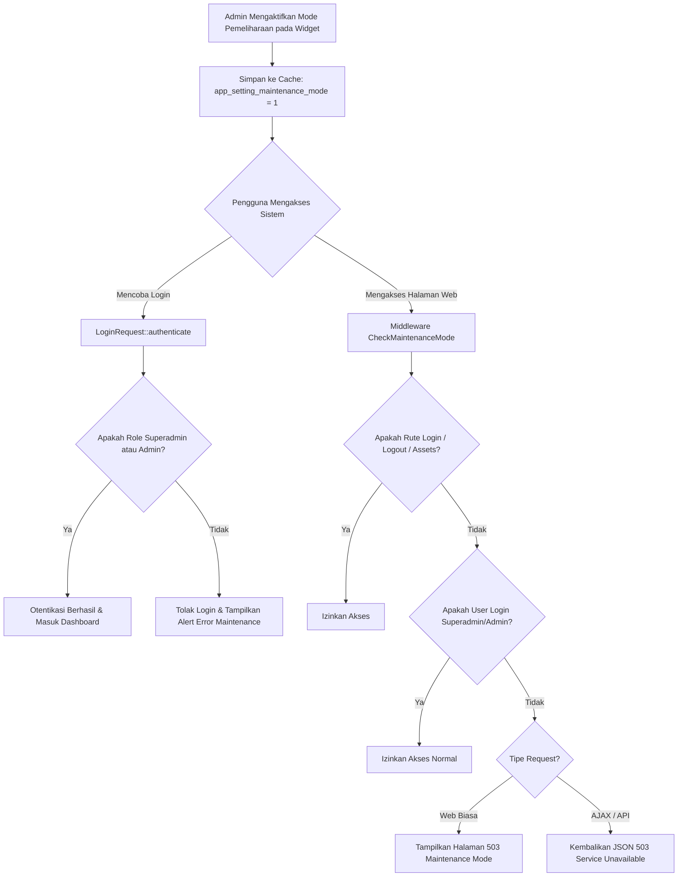

# ⚙️ Dokumentasi Arsitektur & Operasional Fitur dan Pengaturan Aplikasi

> **Status Modul:** Production-Ready (Enterprise Grade)  
> **Lokasi File Dokumentasi:** `docs/arsitektur_dan_operasional_fitur_dan_pengaturan_aplikasi.md`  
> **Route URL:** `/admin/dukunganaplikasi/fitur-aplikasi`  
> **Versi Rilis:** `v2.4.0`  
> **Terakhir Diperbarui:** 31 Agustus 2026 19:10 WIB  

---

## 📋 1. Pendahuluan & Ringkasan Modul

Modul **Fitur Aplikasi & Pusat Pengaturan Sistem** pada REPALOGIC Dashboard dirancang sebagai **Hub Kontrol Terpadu** (*Control Center*) untuk mengelola visibilitas komponen antarmuka, pengaturan keamanan sesi, mode pemeliharaan operasional, sinkronisasi polling real-time, serta pemeliharaan cache server secara instan tanpa perlu memodifikasi kode sumber.

Halaman ini menggabungkan **6 Widget Kontrol Interaktif** pada bagian atas dan **Tabel Manajemen Visibilitas Fitur** pada bagian bawah.

```
┌─────────────────────────────────────────────────────────────────────────────────────────────┐
│                          HUB PUSAT PENGATURAN & FITUR APLIKASI                              │
├──────────────────────────────┬──────────────────────────────┬───────────────────────────────┤
│ 1. Visibilitas Fitur & Menu  │ 2. Waktu Idle & Auto Lock    │ 3. Status Sistem & Maint.     │
├──────────────────────────────┼──────────────────────────────┼───────────────────────────────┤
│ 4. Keamanan & Proteksi Akun  │ 5. Polling & Notifikasi Live │ 6. Cache & Optimasi Kinerja   │
├──────────────────────────────┴──────────────────────────────┴───────────────────────────────┤
│                   TABEL DAFTAR FITUR APLIKASI & MANAJEMEN VISIBILITAS                       │
│    (Auto-Save Instant Toggle, Bulk Actions, Live Filter Kategori, Modal Tambah/Edit)        │
└─────────────────────────────────────────────────────────────────────────────────────────────┘
```

---

## 🛠️ 2. Arsitektur Panel Widget Pengaturan Aplikasi

### 2.1 Widget 1: Visibilitas Fitur & Komponen UI (Hub Kontrol)
- **Fungsi:** Mengawasi proporsi fitur sistem yang aktif (*enabled*) dibandingkan total fitur terdaftar melalui *progress bar* real-time.
- **Aksi Cepat:**
  - Tombol **Buka Manajemen Fitur**: Melakukan *smooth scroll* langsung ke tabel visibilitas fitur di bagian bawah.
  - Tombol **Tambah Fitur Baru**: Membuka modal pendaftaran komponen fitur/menu baru.

### 2.2 Widget 2: Pengaturan Waktu Idle & Auto Lock Screen
- **Fungsi:** Mengatur batas waktu ketidakaktifan (*idle timeout*) pengguna sebelum modal **Lock Screen** muncul secara otomatis untuk mengunci layar demi keamanan data sensitif.
- **Pilihan Durasi:** `1 Menit` (Mode Pengujian), `3 Menit`, `5 Menit` (Standar Rekomendasi), `10 Menit`, `15 Menit`, `30 Menit`, `60 Menit`, atau `0` (Nonaktifkan Auto-Lock).
- **Mekanisme Penyimpanan:**
  - Disimpan ke database cache server via endpoint `POST /admin/dukunganaplikasi/fitur-aplikasi/update-setting` (`key: 'idle_timeout_minutes'`).
  - Disinkronkan langsung ke `localStorage.setItem('repalogic_idle_timeout_minutes', mins)` melalui helper global `window.setIdleTimeoutMinutes(mins)`.
- **Fitur Uji Coba:** Tombol **Uji Kunci** memanggil fungsi `window.lockScreen()` seketika untuk menguji animasi dan verifikasi pembukaan kunci dengan kata sandi akun aktif.

### 2.3 Widget 3: Status Sistem & Mode Pemeliharaan (Maintenance Mode)
- **Fungsi:** Mengaktifkan mode pemeliharaan sistem berkala (*system maintenance*) dengan pesan pengumuman kustom yang dapat diatur secara dinamis.
- **Mekanisme Akses & Bypass:**
  - **Superadmin & Admin:** Tetap memiliki akses penuh ke seluruh rute admin dan dashboard untuk melakukan pemeliharaan (*bypass* otomatis).
  - **Akun Non-Admin (Operator, User, Tamu):** Diblokir saat mencoba login atau dialihkan ke halaman responsif **503 Maintenance Page** jika mengakses halaman web.

### 2.4 Widget 4: Keamanan Sesi & Proteksi Login
- **Fungsi:** Mengatur batas maksimal percobaan login gagal sebelum akun dikenakan *rate limiting lockout* (`3x`, `5x`, atau `10x`).
- **Fitur Tambahan:**
  - Sakelar *Otomatis Setujui Pendaftaran Akun Baru*.
  - Sakelar *Notifikasi Login dari Perangkat Baru*.

### 2.5 Widget 5: Sinkronisasi Polling & Notifikasi Real-Time
- **Fungsi:** Mengatur interval *background polling* untuk sinkronisasi pesan obrolan topbar dan notifikasi lonceng (`10 Detik`, `20 Detik`, `30 Detik`, `60 Detik`).
- **Fitur Tambahan:**
  - Sakelar *Audio Suara Notifikasi (Chime)*.
  - Sakelar *Pop-up Toast Notifikasi Otomatis*.

### 2.6 Widget 6: Manajemen Cache & Optimasi Kinerja Server
- **Fungsi:** Mengosongkan seluruh lapisan cache sistem secara bersamaan dengan satu kali klik.
- **Proses Eksekusi Internal:**
  ```php
  Artisan::call('view:clear');    // Membersihkan compiled Blade views
  Artisan::call('config:clear');  // Membersihkan cached configurations
  Artisan::call('route:clear');   // Membersihkan route cache
  Artisan::call('cache:clear');   // Membersihkan application cache store
  FiturAplikasi::clearCache();    // Reset cached feature maps
  ProfilAplikasi::clearCache();   // Reset cached profile settings
  ```

---

## 🔒 3. Alur Kerja & Operasional Mode Pemeliharaan (Maintenance Mode)

### 3.1 Diagram Alur Eksekusi (Flowchart)



### 3.2 Intersepsi Login (`app/Http/Requests/Auth/LoginRequest.php`)
Ketika pengguna memasukkan email dan password di `/login`:
1. Sistem memvalidasi kebenaran email dan password.
2. Sistem mengecek status persetujuan akun (`isPending()`, `isRejected()`, `isInactive()`).
3. Sistem memeriksa `app_setting_maintenance_mode`:
   ```php
   $isMaintenance = (bool) Cache::get('app_setting_maintenance_mode', false);
   if ($isMaintenance && ! $user->hasRole('superadmin') && ! $user->hasRole('admin')) {
       RateLimiter::hit($this->throttleKey());
       $this->flashOnly(['email']);

       $maintenanceMsg = Cache::get('app_setting_maintenance_message', 'Sistem sedang dalam proses pemeliharaan berkala.');

       throw ValidationException::withMessages([
           'maintenance' => $maintenanceMsg,
       ]);
   }
   ```
4. Jika bukan superadmin/admin, proses login dihentikan dan formulir login menampilkan alert peringatan berwarna merah ber-ikon kunci pemeliharaan.

### 3.3 Middleware Pengecekan Global (`app/Http/Middleware/CheckMaintenanceMode.php`)
Mencegah pengguna non-admin yang sedang aktif (*session already active*) atau pengunjung umum menjelajahi aplikasi:
- Didaftarkan ke grup middleware `web` di `bootstrap/app.php`.
- Mengizinkan rute `/login`, `/logout`, `/up`, `/assets/*`, dan `/storage/*` agar Administrator tetap dapat mengakses portal masuk kapan saja.
- Menampilkan tampilan `resources/views/errors/503.blade.php` lengkap dengan pesan pengumuman kustom dan tombol *"Masuk Administrator"*.

---

## ⏱️ 4. Alur Kerja Waktu Idle & Layar Terkunci (Auto Lock Screen)

### 4.1 Sinkronisasi Durasi Timer
1. Pengaturan waktu idle dibaca dengan urutan prioritas:
   ```javascript
   function getIdleTimeoutMs() {
       const stored = localStorage.getItem('repalogic_idle_timeout_minutes');
       const mins = (stored !== null && stored !== '') ? parseInt(stored) : serverIdleMinutes;
       if (mins <= 0) return 0; // 0 = Dinonaktifkan
       return mins * 60 * 1000;
   }
   ```
2. Setiap kali pengguna melakukan aktivitas (`mousemove`, `mousedown`, `keydown`, `scroll`, `touchstart`, `click`), sistem me-reset timer ketidakaktifan dengan teknik *throttling* (1 detik).
3. Jika waktu ketidakaktifan mencapai batas, fungsi `window.lockScreen()` otomatis memunculkan modal lock screen dengan efek *ultra-blur backdrop*.

---

## 🌐 5. Daftar Rute & Endpoint API Modul

| Method | URI Route | Nama Rute | Controller & Method | Keterangan |
| :--- | :--- | :--- | :--- | :--- |
| `GET` | `/admin/dukunganaplikasi/fitur-aplikasi` | `admin.dukunganaplikasi.fitur-aplikasi.index` | `FiturAplikasiController@index` | Menampilkan halaman hub kontrol & daftar fitur |
| `POST` | `/admin/dukunganaplikasi/fitur-aplikasi` | `admin.dukunganaplikasi.fitur-aplikasi.store` | `FiturAplikasiController@store` | Menyimpan fitur aplikasi baru |
| `POST` | `/admin/dukunganaplikasi/fitur-aplikasi/toggle` | `admin.dukunganaplikasi.fitur-aplikasi.toggle` | `FiturAplikasiController@toggleFeature` | Toggle status visibilitas fitur instan via AJAX |
| `POST` | `/admin/dukunganaplikasi/fitur-aplikasi/toggle-group` | `admin.dukunganaplikasi.fitur-aplikasi.toggle-group` | `FiturAplikasiController@toggleGroup` | Toggle masal seluruh fitur dalam satu kategori |
| `POST` | `/admin/dukunganaplikasi/fitur-aplikasi/bulk-action` | `admin.dukunganaplikasi.fitur-aplikasi.bulk-action` | `FiturAplikasiController@bulkAction` | Aksi masal (aktifkan, nonaktifkan, hapus terpilih) |
| `POST` | `/admin/dukunganaplikasi/fitur-aplikasi/clear-cache` | `admin.dukunganaplikasi.fitur-aplikasi.clear-cache` | `FiturAplikasiController@clearSystemCache` | Membersihkan seluruh cache server (Views, Config, Routes) |
| `POST` | `/admin/dukunganaplikasi/fitur-aplikasi/update-setting` | `admin.dukunganaplikasi.fitur-aplikasi.update-setting` | `FiturAplikasiController@updateAppSetting` | Menyimpan konfigurasi widget setting aplikasi |
| `PUT` | `/admin/dukunganaplikasi/fitur-aplikasi/{id}` | `admin.dukunganaplikasi.fitur-aplikasi.update` | `FiturAplikasiController@update` | Memperbarui data detail fitur |
| `DELETE` | `/admin/dukunganaplikasi/fitur-aplikasi/{id}` | `admin.dukunganaplikasi.fitur-aplikasi.destroy` | `FiturAplikasiController@destroy` | Menghapus fitur dari database |

---

## 📂 6. Struktur File & Komponen Terkait

```
repalogic-dashboard/
├── app/
│   ├── Http/
│   │   ├── Controllers/Admin/DukunganAplikasi/
│   │   │   └── FiturAplikasiController.php         # Handler logika hub fitur, cache & settings
│   │   ├── Middleware/
│   │   │   └── CheckMaintenanceMode.php           # Middleware pembatasan akses saat maintenance
│   │   └── Requests/
│   │       ├── Admin/DukunganAplikasi/
│   │       │   └── FiturAplikasiRequest.php       # Validasi form input data fitur
│   │       └── Auth/
│   │           └── LoginRequest.php               # Validasi otentikasi login & maintenance check
│   └── Models/Admin/DukunganAplikasi/
│       ├── FiturAplikasi.php                      # Model representasi tabel fitur_aplikasi
│       └── FeatureSettingMap.php                  # Safe helper object untuk cached feature flags
├── bootstrap/
│   └── app.php                                    # Registrasi CheckMaintenanceMode ke web middleware
├── resources/views/
│   ├── admin/dukunganaplikasi/
│   │   ├── fitur-aplikasi.blade.php               # View utama panel widget & tabel visibilitas fitur
│   │   └── partials/
│   │       └── fitur_aplikasi_modal.blade.php     # Modal form tambah & edit fitur
│   ├── auth/
│   │   └── login.blade.php                        # View login dengan penanganan alert maintenance
│   ├── errors/
│   │   └── 503.blade.php                          # Halaman responsif 503 Mode Pemeliharaan
│   └── layouts/partials/
│       └── lock-screen-modal.blade.php            # Modal lock screen & dynamic idle timer engine
└── docs/
    └── arsitektur_dan_operasional_fitur_dan_pengaturan_aplikasi.md
```

---

## 💡 7. Panduan Pengujian & Verifikasi Fitur

### 7.1 Menguji Mode Pemeliharaan (Maintenance Mode)
1. Buka rute `admin/dukunganaplikasi/fitur-aplikasi`.
2. Pada **Widget 3 (Status Sistem & Maintenance)**, aktifkan sakelar dan klik **Simpan Status Pemeliharaan**.
3. Buka peramban baru dalam mode *Incognito/Private Browser*:
   - Coba masuk menggunakan akun ber-role `operator` atau `user`. Sistem akan menolak login dengan pesan *"Mode Pemeliharaan Aktif"*.
   - Buka halaman utama atau URL lain (misal `/dashboard`). Sistem akan menampilkan halaman **503 Mode Pemeliharaan**.
4. Coba masuk menggunakan akun ber-role `superadmin` atau `admin`. Akun berhasil masuk dan dapat mengakses seluruh dashboard secara normal.

### 7.2 Menguji Waktu Idle (Auto Lock Screen)
1. Pada **Widget 2 (Waktu Idle & Auto Lock)**, pilih `1 Menit (Mode Pengujian)` dan klik **Simpan Durasi Idle**.
2. Biarkan layar tanpa gerakan mouse atau ketukan keyboard selama 1 menit. Layar akan terkunci otomatis dan memunculkan modal Lock Screen.
3. Atau klik tombol **Uji Kunci** untuk memicu penguncian layar secara instan.
4. Masukkan password akun Anda untuk membuka kembali kunci layar.

### 7.3 Menguji Pembersihan Cache Sistem
1. Pada **Widget 6 (Cache & Optimasi Kinerja)**, klik tombol **Bersihkan Semua Cache**.
2. Konfirmasi dialog SweetAlert2.
3. Notifikasi sukses akan muncul setelah seluruh cache Blade, Routes, Config, dan Application Cache store berhasil dibersihkan.
