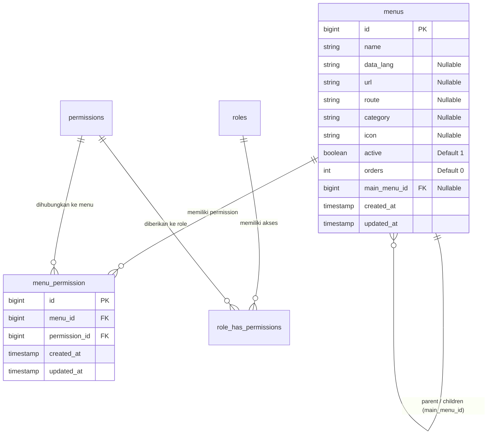
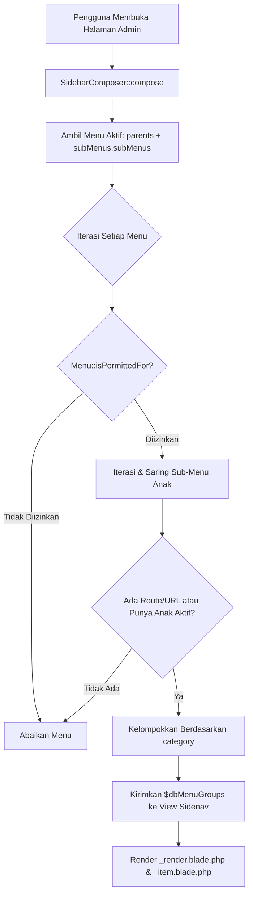

# 🧭 Dokumentasi Arsitektur & Operasional Modul Manajemen Menu

> **Status Modul:** Production-Ready (Enterprise Grade Modular Architecture)  
> **Lokasi File Dokumentasi:** `docs/arsitektur_dan_operasional_manajemen_menu.md`  
> **Route URL:** `/admin/dukunganaplikasi/menu`  
> **Controller:** [`App\Http\Controllers\Admin\DukunganAplikasi\MenuController`](../app/Http/Controllers/Admin/DukunganAplikasi/MenuController.php)  
> **Model:** [`App\Models\Admin\DukunganAplikasi\Menu`](../app/Models/Admin/DukunganAplikasi/Menu.php)  
> **Aset Terpisah (Rule 15):** [`public/assets/css/admin/dukunganaplikasi/menu.css`](../public/assets/css/admin/dukunganaplikasi/menu.css) & [`public/assets/js/admin/dukunganaplikasi/menu.js`](../public/assets/js/admin/dukunganaplikasi/menu.js)  
> **Terakhir Diperbarui:** 04 September 2026 09:22 WIB  

---

## 📋 1. Pendahuluan & Ringkasan Modul

Modul **Manajemen Menu** (*Menu Management Engine*) pada REPALOGIC Dashboard berfungsi sebagai pusat kendali (*control center*) untuk mengatur struktur navigasi antarmuka, hierarki menu, hak akses Spatie Permission, pengurutan interaktif (*drag & drop*), status visibilitas, hingga sinkronisasi kamus multi-bahasa (*bilingual translations*) secara terpusat dan dinamis tanpa harus mengubah kode sumber aplikasi.

```
┌─────────────────────────────────────────────────────────────────────────────────────────────┐
│                          HUB PUSAT MANAJEMEN MENU & NAVIGASI                                │
├──────────────────────────────┬──────────────────────────────┬───────────────────────────────┤
│ 1. Hierarki 3 Level Dinamis  │ 2. Drag & Drop Reordering    │ 3. Instant Status & Cascade   │
│ (Kategori > Parent > Sub L3) │ (SortableJS Multi-Level)     │ (Category / Parent / Submenu) │
├──────────────────────────────┼──────────────────────────────┼───────────────────────────────┤
│ 4. Spatie Permission Sync    │ 5. Auto Bilingual Generator  │ 6. Dynamic Sidebar Composer   │
│ (CRUD Actions & Role Binding)│ (sidebar_menu.json Auto Sync)│ (Recursive Permission Filter) │
└────────────────────────────────┴──────────────────────────────┴───────────────────────────────┘
```

### 🌟 Fitur Utama Modul:
1. **Hierarki 3 Level Fleksibel:** Mendukung pengelompokan berdasarkan **Kategori Header**, **Menu Utama (Parent)**, hingga **Sub-Menu Level 2 & Level 3**.
2. **Reordering Drag & Drop Interaktif:** Menggunakan pustaka *SortableJS* dengan 3 handle khusus untuk mengubah urutan kategori, menu utama, dan sub-menu secara mulus dengan penyimpanan otomatis ke server via AJAX.
3. **Peralihan Status Instan (*Cascading Status Toggle*):** Sakelar on/off yang mendukung pembaruan berjenjang; mematikan Kategori atau Menu Utama akan secara otomatis menonaktifkan seluruh sub-menu di bawahnya secara rekursif.
4. **Sinkronisasi Otomatis Spatie Permission:** Setiap pembuatan/pembaruan menu otomatis mendaftarkan permission CRUD (`create`, `read`, `update`, `delete`) dan mengaitkannya ke Role yang dipilih (`superadmin`, `admin`, dll).
5. **Generasi Kamus Bilingual Modular Otomatis:** Saat menu disimpan, model hook `Menu::syncTranslationKey()` otomatis mendaftarkan `data_lang` ke `public/assets/data/translations/id/sidebar_menu.json` dan `en/sidebar_menu.json` serta master fallback file.
6. **Rendering Sidebar Dinamis Terpusat:** Terhubung langsung dengan `App\Http\ViewComposers\SidebarComposer` untuk menampilkan menu sesuai hak akses pengguna aktif secara real-time.

---

## 🏛️ 2. Arsitektur Database & Skema Relasi

Modul ini bertumpu pada tabel `menus` yang memiliki relasi rekursif mandiri (*self-referencing foreign key*) serta tabel *pivot* `menu_permission` yang menghubungkan menu dengan tabel `permissions` bawaan Spatie.

### 2.1 Skema Tabel `menus`

| Kolom | Tipe Data | Keterangan & Constraint |
| :--- | :--- | :--- |
| `id` | `BIGINT UNSIGNED` | Primary Key, Auto Increment |
| `name` | `VARCHAR(255)` | Nama menu yang ditampilkan di antarmuka |
| `data_lang` | `VARCHAR(100)` | Key terjemahan bilingual (Nullable, contoh: `manajemen-user`) |
| `url` | `VARCHAR(255)` | URL path absolut/relatif (Nullable, contoh: `admin/dukunganaplikasi/menu`) |
| `route` | `VARCHAR(255)` | Nama Route Laravel (Nullable, contoh: `admin.dukunganaplikasi.menu.index`) |
| `category` | `VARCHAR(255)` | Nama Kategori / Grup Header Sidebar (Nullable, contoh: `DUKUNGAN APLIKASI`) |
| `icon` | `VARCHAR(100)` | Class Icon Tabler/RemixIcon (Nullable, contoh: `ti ti-smart-home`) |
| `active` | `TINYINT(1)` | Status aktif/visibilitas (Default: `1` / True) |
| `orders` | `INTEGER` | Urutan penomoran tampilan (Default: `0`) |
| `main_menu_id` | `BIGINT UNSIGNED` | Foreign Key ke `menus.id` (Nullable, Self-Referencing Parent ID) |
| `created_at` / `updated_at` | `TIMESTAMP` | Timestamps Eloquent |

### 2.2 Skema Tabel `menu_permission` (Pivot)

| Kolom | Tipe Data | Keterangan & Constraint |
| :--- | :--- | :--- |
| `id` | `BIGINT UNSIGNED` | Primary Key, Auto Increment |
| `menu_id` | `BIGINT UNSIGNED` | Foreign Key ke `menus.id` |
| `permission_id` | `BIGINT UNSIGNED` | Foreign Key ke `permissions.id` (Spatie Permission) |
| `created_at` / `updated_at` | `TIMESTAMP` | Timestamps Eloquent |

### 2.3 Diagram Relasi Entitas (Mermaid ERD)



---

## 🔄 3. Integrasi Sidebar Dinamis (`SidebarComposer`)

Navigasi sidebar dashboard di-render secara otomatis dari database melalui View Composer [`SidebarComposer.php`](../app/Http/ViewComposers/SidebarComposer.php).

### 3.1 Alur Rekursif Penyaringan Menu



### 3.2 Evaluasi Akses `isPermittedFor($user)`:
1. **Superadmin:** Selalu diizinkan (*bypassed*).
2. **User Biasa:** Jika menu memiliki entitas permission terdaftar di tabel `menu_permission`, sistem memeriksa apakah pengguna memiliki minimal salah satu permission (`$user->can($perm->name)`).
3. **Menu Publik:** Jika tidak ada permission yang dikaitkan ke menu, menu dianggap publik untuk seluruh pengguna terotentikasi.

---

## 📑 4. Panduan Operasional & Pemecahan Masalah (Troubleshooting)

### 4.1 Panduan Langkah Demi Langkah

#### A. Menambahkan Menu Utama Baru:
1. Masuk ke menu **Dukungan Aplikasi > Menu**.
2. Klik tombol **Tambah Menu Baru**.
3. Isi **Nama Menu** (misal: `Laporan Keuangan`).
4. Biarkan *Main Menu Parent* kosong (`-- Tanpa Parent (Menu Utama) --`).
5. Masukkan nama **Kategori** (misal: `KEUANGAN & AKUNTANSI`).
6. Masukkan class icon (misal: `ti ti-report-money`).
7. Tentukan **Nama Route** (misal: `admin.laporan.index`) atau URL.
8. Pilih checklist hak akses (Read, Create, Update, Delete) dan Role yang diizinkan (Superadmin, Admin).
9. Klik **Simpan Menu**. Menu akan langsung muncul di sidebar!

#### B. Menambahkan Sub-Menu (Level 2 atau Level 3):
1. Buka modal **Tambah Menu Baru**.
2. Pilih parent pada dropdown **Main Menu Parent** (pilih Menu Utama untuk Level 2, atau pilih Sub-Menu L2 untuk membuat Level 3).
3. Isi kolom nama dan route sesuai kebutuhan.
4. Klik **Simpan Menu**.

#### C. Mengubah Urutan Menu (*Drag & Drop*):
1. Arahkan kursor pada ikon handle:
   - Handle Kuning (`ti-grip-vertical`): Menggeser seluruh Kategori.
   - Handle Biru (`ti-menu-2`): Menggeser Menu Utama.
   - Handle Abu-abu (`ti-dots-vertical`): Menggeser Sub-Menu.
2. Klik dan geser ke posisi yang diinginkan lalu lepaskan. Sistem otomatis menyimpan urutan baru dan memuat ulang data.

---

### 4.2 Pemecahan Masalah (Troubleshooting)

| Gejala Masalah | Penyebab Umum | Solusi Perbaikan |
| :--- | :--- | :--- |
| **Menu baru tidak muncul di sidebar** | Pengguna yang sedang login belum memiliki permission yang dikaitkan, atau menu disetel nonaktif (`active = 0`). | Pastikan checkbox status aktif tercentang dan Role pengguna telah dicentang pada form menu. Lakukan reload atau logout-login ulang. |
| **Urutan menu kembali ke posisi semula setelah di-drag** | Token CSRF kedaluwarsa atau terjadi galat AJAX saat request ke `/admin/dukunganaplikasi/menu/reorder`. | Periksa konsol browser (F12 > Console/Network). Pastikan `meta[name="csrf-token"]` tersedia dan sesi masih aktif. |
| **Teks terjemahan bahasa Inggris tidak berubah** | Key `data_lang` belum sinkron dengan `en/sidebar_menu.json`. | Buka modal **Petunjuk Bilingual** atau jalankan perintah `php artisan menu:lang-sync` di terminal. |
| **Muncul error PermissionRegistrar Cache** | Cache Spatie permission belum dibersihkan setelah perubahan database manual. | Jalankan `php artisan permission:cache-reset` dan `php artisan cache:clear`. |

---

> 📌 **Dokumentasi ini dikelola secara resmi oleh Tim Pengembang REPALOGIC Dashboard.**  
> *Setiap perubahan skema database, controller, atau alur drag & drop wajib memperbarui berkas dokumentasi ini.*
