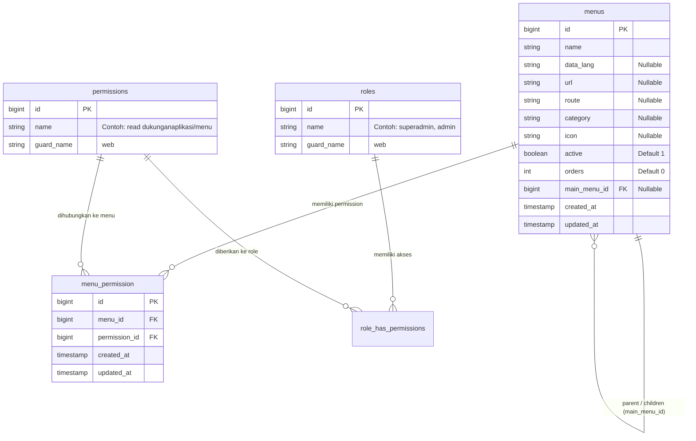
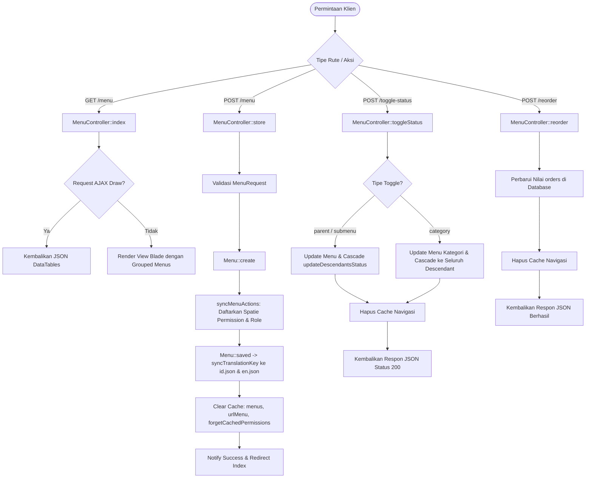
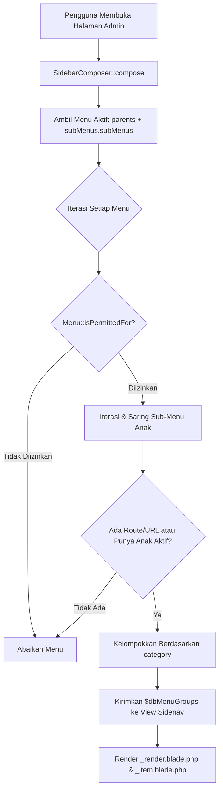

# 🧭 Dokumentasi Arsitektur & Operasional Modul Manajemen Menu

> **Status Modul:** Production-Ready (Enterprise Grade)  
> **Lokasi File Dokumentasi:** `docs/arsitektur_dan_operasional_manajemen_menu.md`  
> **Route URL:** `/admin/dukunganaplikasi/menu`  
> **Controller:** `App\Http\Controllers\Admin\DukunganAplikasi\MenuController`  
> **Model:** `App\Models\Admin\DukunganAplikasi\Menu`  
> **Versi Rilis:** `v2.4.0`  
> **Terakhir Diperbarui:** 1 September 2026 21:00 WIB  

---

## 📋 1. Pendahuluan & Ringkasan Modul

Modul **Manajemen Menu** (*Menu Management Engine*) pada REPALOGIC Dashboard berfungsi sebagai pusat kendali (*control center*) untuk mengatur struktur navigasi antarmuka, hierarki menu, hak akses Spatie Permission, pengurutan interaktif (*drag & drop*), status visibilitas, hingga sinkronisasi kamus multi-bahasa (*bilingual translations*) secara terpusat dan dinamis tanpa harus mengubah kode sumber aplikasi.

```
┌─────────────────────────────────────────────────────────────────────────────────────────────┐
│                          HUB PUSAT MANAJEMEN MENU & NAVIGASI                                │
├──────────────────────────────┬──────────────────────────────┬───────────────────────────────┤
│ 1. Hierarki 3 Level Dinamis  │ 2. Drag & Drop Reordering    │ 3. Instant Status & Cascade   │
│ (Kategori > Parent > Sub L3) │ (SortableJS Multi-Level)     │ (Category / Parent / Submenu) │
├──────────────────────────────┼──────────────────────────────┼───────────────────────────────┤
│ 4. Spatie Permission Sync    │ 5. Auto Bilingual Generator  │ 6. Dynamic Sidebar Composer   │
│ (CRUD Actions & Role Binding)│ (id.json & en.json Auto Sync)│ (Recursive Permission Filter) │
└──────────────────────────────┴──────────────────────────────┴───────────────────────────────┘
```

### 🌟 Fitur Utama Modul:
1. **Hierarki 3 Level Fleksibel:** Mendukung pengelompokan berdasarkan **Kategori Header**, **Menu Utama (Parent)**, hingga **Sub-Menu Level 2 & Level 3**.
2. **Reordering Drag & Drop Interaktif:** Menggunakan pustaka *SortableJS* dengan 3 handle khusus untuk mengubah urutan kategori, menu utama, dan sub-menu secara mulus dengan penyimpanan otomatis ke server via AJAX.
3. **Peralihan Status Instan (*Cascading Status Toggle*):** Sakelar on/off yang mendukung pembaruan berjenjang; mematikan Kategori atau Menu Utama akan secara otomatis menonaktifkan seluruh sub-menu di bawahnya secara rekursif.
4. **Sinkronisasi Otomatis Spatie Permission:** Setiap pembuatan/pembaruan menu otomatis mendaftarkan permission CRUD (`create`, `read`, `update`, `delete`) dan mengaitkannya ke Role yang dipilih (`superadmin`, `admin`, dll).
5. **Generasi Kamus Bilingual Otomatis:** Saat menu disimpan, *model lifecycle listener* otomatis mendaftarkan `data_lang` ke berkas `public/assets/data/translations/id.json` dan `en.json`.
6. **Rendering Sidebar Dinamis Terpusat:** Terhubung langsung dengan `App\Http\ViewComposers\SidebarComposer` untuk menampilkan menu sesuai hak akses pengguna aktif secara real-time.

---

## 🏛️ 2. Arsitektur Database & Skema Relasi

Modul ini bertumpu pada tabel `menus` yang memiliki relasi rekursif mandiri (*self-referencing foreign key*) serta tabel *pivot* `menu_permission` yang menghubungkan menu dengan tabel `permissions` bawaan Spatie.

### 2.1 Skema Tabel `menus`

| Kolom | Tipe Data | Keterangan & Constraint |
| :--- | :--- | :--- |
| `id` | `BIGINT UNSIGNED` | Primary Key, Auto Increment |
| `name` | `VARCHAR(255)` | Nama menu yang ditampilkan di antarmuka |
| `data_lang` | `VARCHAR(100)` | Key terjemahan bilingual (Nullable, contoh: `manajemen-user`) |
| `url` | `VARCHAR(255)` | URL path absolut/relatif (Nullable, contoh: `admin/dukunganaplikasi/menu`) |
| `route` | `VARCHAR(255)` | Nama Route Laravel (Nullable, contoh: `admin.dukunganaplikasi.menu.index`) |
| `category` | `VARCHAR(255)` | Nama Kategori / Grup Header Sidebar (Nullable, contoh: `DUKUNGAN APLIKASI`) |
| `icon` | `VARCHAR(100)` | Class Icon Tabler/RemixIcon (Nullable, contoh: `ti ti-smart-home`) |
| `active` | `TINYINT(1)` | Status aktif/visibilitas (Default: `1` / True) |
| `orders` | `INTEGER` | Urutan penomoran tampilan (Default: `0`) |
| `main_menu_id` | `BIGINT UNSIGNED` | Foreign Key ke `menus.id` (Nullable, Self-Referencing Parent ID) |
| `created_at` / `updated_at` | `TIMESTAMP` | Timestamps Eloquent |

### 2.2 Skema Tabel `menu_permission` (Pivot)

| Kolom | Tipe Data | Keterangan & Constraint |
| :--- | :--- | :--- |
| `id` | `BIGINT UNSIGNED` | Primary Key, Auto Increment |
| `menu_id` | `BIGINT UNSIGNED` | Foreign Key ke `menus.id` |
| `permission_id` | `BIGINT UNSIGNED` | Foreign Key ke `permissions.id` (Spatie Permission) |
| `created_at` / `updated_at` | `TIMESTAMP` | Timestamps Eloquent |

### 2.3 Diagram Relasi Entitas (Mermaid ERD)



---

## ⚙️ 3. Arsitektur Backend & Daftar Endpoint API

Seluruh permintaan pada modul ini ditangani oleh [`MenuController.php`](../app/Http/Controllers/Admin/DukunganAplikasi/MenuController.php) yang dilindungi oleh middleware `['web', 'auth']`.

### 3.1 Daftar Rute & Endpoint Modul

| HTTP Method | Route URI | Nama Route | Fungsi & Deskripsi |
| :---: | :--- | :--- | :--- |
| `GET` | `/admin/dukunganaplikasi/menu` | `admin.dukunganaplikasi.menu.index` | Menampilkan tabel hierarki menu (Dual mode: HTML View & DataTables AJAX). |
| `POST` | `/admin/dukunganaplikasi/menu` | `admin.dukunganaplikasi.menu.store` | Menyimpan menu baru beserta sinkronisasi permission & role. |
| `PUT / PATCH` | `/admin/dukunganaplikasi/menu/{id}` | `admin.dukunganaplikasi.menu.update` | Memperbarui data menu, relasi parent, icon, serta hak akses. |
| `DELETE` | `/admin/dukunganaplikasi/menu/{id}` | `admin.dukunganaplikasi.menu.destroy` | Menghapus menu dari database beserta relasi pivot permission. |
| `POST` | `/admin/dukunganaplikasi/menu/toggle-status` | `admin.dukunganaplikasi.menu.toggle-status` | AJAX instant toggle switch untuk Kategori, Menu Utama, atau Sub-Menu. |
| `POST` | `/admin/dukunganaplikasi/menu/reorder` | `admin.dukunganaplikasi.menu.reorder` | AJAX reordering untuk menyimpan posisi hasil drag & drop. |

### 3.2 Diagram Alur Pemrosesan Menu (Flowchart)



---

## 🛡️ 4. Pola Integrasi Hak Akses & Spatie Permissions

Modul ini mengimplementasikan Trait [`App\Traits\HasMenuPermission`](../app/Traits/HasMenuPermission.php) untuk mengotomatisasi generasi permission standar.

### 4.1 Mekanisme Resolusi Permission Target

Method `getPermissionTarget(Menu $menu)` menghasilkan target slug yang bersih dan konsisten:
1. Jika memiliki `route` (misal: `admin.dukunganaplikasi.menu.index`), dibersihkan menjadi:  
   `dukunganaplikasi/menu`
2. Jika memiliki `url` (misal: `admin/manajemenpengguna/user`), dibersihkan menjadi:  
   `manajemenpengguna/user`
3. Jika berupa Header Container (hanya `category` & `name`), dikonversi menjadi slug:  
   `{category-slug}/{name-slug}`

### 4.2 Matriks Hak Akses CRUD

Ketika form menu disimpan dengan mencentang kotak aksi, sistem akan membuat entitas Spatie Permission dengan format:

```text
create {target}   -> Contoh: create dukunganaplikasi/menu
read {target}     -> Contoh: read dukunganaplikasi/menu
update {target}   -> Contoh: update dukunganaplikasi/menu
delete {target}   -> Contoh: delete dukunganaplikasi/menu
```

### 4.3 Sinkronisasi Role & Pembersihan Cache Otomatis

Method `syncMenuActions()` memastikan:
```php
// app/Traits/HasMenuPermission.php
public function syncMenuActions(Menu $menu, array $actions = [], array|string|null $roles = null): void
{
    // 1. Buat permission jika belum ada di database
    // 2. Kaitkan permission ke Role yang dipilih (default: superadmin, admin)
    // 3. Sinkronisasikan ID permission ke menu_permission pivot
    // 4. Bersihkan cache permissions dan navigasi seketika
    app()[PermissionRegistrar::class]->forgetCachedPermissions();
    Cache::forget('menus');
    Cache::forget('urlMenu');
}
```

---

## 🌐 5. Arsitektur Bilingual & Kamus Multi-Bahasa

REPALOGIC Dashboard mendukung pengalihan bahasa instan (ID / EN) pada seluruh navigasi sidebar.

### 5.1 Siklus Sinkronisasi Otomatis (*Model Lifecycle Hook*)

Model [`Menu.php`](../app/Models/Admin/DukunganAplikasi/Menu.php) mendengarkan event `saved`:

```php
protected static function booted()
{
    static::saved(function (Menu $menu) {
        static::syncTranslationKey($menu);
    });
}
```

Alur kerja `syncTranslationKey()`:
1. Membaca properti `data_lang` (atau men-generate dari `Str::slug($menu->name)` jika kosong).
2. Membuka berkas `public/assets/data/translations/id.json` dan `en.json`.
3. Menambahkan key terjemahan bahasa Indonesia (`$menu->name`) dan padanan bahasa Inggris otomatis melalui kamus cerdas `getEnglishDefault()`.
4. Menyimpan kembali berkas JSON dengan format rapi (*JSON_PRETTY_PRINT*).

### 5.2 Perintah Artisan CLI Sinkronisasi Masal

Untuk memindai dan menyinkronkan seluruh key terjemahan di seluruh proyek, tersedia perintah Artisan khusus:

```bash
php artisan menu:lang-sync
```

---

## 🎨 6. Arsitektur Frontend, Tampilan & Interaksi Pengguna

Sesuai dengan standar arsitektur sistem, kode antarmuka dipisahkan secara bersih antara file Blade, CSS, dan JavaScript eksternal.

### 6.1 Pemisahan Berkas Aset (*Asset Separation Standard*)
- **Blade View Utama:** [`resources/views/admin/dukunganaplikasi/menu.blade.php`](../resources/views/admin/dukunganaplikasi/menu.blade.php)
- **Komponen Form Modal:** [`resources/views/admin/dukunganaplikasi/partials/menu_form.blade.php`](../resources/views/admin/dukunganaplikasi/partials/menu_form.blade.php)
- **Modal Petunjuk Bilingual:** [`resources/views/admin/dukunganaplikasi/partials/bilingual_guide_modal.blade.php`](../resources/views/admin/dukunganaplikasi/partials/bilingual_guide_modal.blade.php)
- **CSS Modul:** [`public/assets/css/admin/dukunganaplikasi/menu.css`](../public/assets/css/admin/dukunganaplikasi/menu.css)
- **JS Modul:** [`public/assets/js/admin/dukunganaplikasi/menu.js`](../public/assets/js/admin/dukunganaplikasi/menu.js)

### 6.2 Jembatan Data Backend-to-Frontend (*Bridge Object*)

```html
<script>
    window.MenuConfig = {
        totalMenuCount: {{ $totalMenuCount }},
        routes: {
            reorder: "{{ route('admin.dukunganaplikasi.menu.reorder') }}",
            toggleStatus: "{{ route('admin.dukunganaplikasi.menu.toggle-status') }}",
            store: "{{ route('admin.dukunganaplikasi.menu.store') }}",
            base: "{{ url('admin/dukunganaplikasi/menu') }}"
        }
    };
</script>
<script src="{{ asset('assets/js/admin/dukunganaplikasi/menu.js') }}"></script>
```

### 6.3 Drag & Drop SortableJS (3 Level Operasional)
Tabel utama dikelompokkan ke dalam beberapa elemen `<tbody>` (`.category-block`):
1. **Level 1 (Kategori):** Drag handle `i.handle-category` menggeser seluruh blok `<tbody>` beserta seluruh menu di dalamnya.
2. **Level 2 (Menu Utama):** Drag handle `i.handle-parent` menggeser baris `.parent-menu-row` beserta sub-menu pengikutnya (`.child-of-{id}`).
3. **Level 3 (Sub-Menu):** Drag handle `i.handle-submenu` mengurutkan baris sub-menu khusus di dalam parent-nya.

### 6.4 Event Delegation & SweetAlert2 (Rule 2 & Rule 9 Compliance)
- Seluruh aksi tombol (Tambah, Edit, Detail, Hapus) dan sakelar toggle menggunakan **Event Delegation** pada level `document`, memastikan tombol tetap berfungsi saat pencarian live aktif atau setelah reload DOM.
- Notifikasi feedback operasi menggunakan helper universal `window.showToast()`.

---

## 🔄 7. Integrasi Sidebar Dinamis (`SidebarComposer`)

Navigasi sidebar dashboard di-render secara otomatis dari database melalui View Composer [`SidebarComposer.php`](../app/Http/ViewComposers/SidebarComposer.php).

### 7.1 Alur Rekursif Penyaringan Menu



### 7.2 Evaluasi Akses `isPermittedFor($user)`:
1. **Superadmin:** Selalu diizinkan (*bypassed*).
2. **User Biasa:** Jika menu memiliki entitas permission terdaftar di tabel `menu_permission`, sistem memeriksa apakah pengguna memiliki minimal salah satu permission (`$user->can($perm->name)`).
3. **Menu Publik:** Jika tidak ada permission yang dikaitkan ke menu, menu dianggap publik untuk seluruh pengguna terotentikasi.

---

## 📑 8. Panduan Operasional & Pemecahan Masalah (Troubleshooting)

### 8.1 Panduan Langkah Demi Langkah

#### A. Menambahkan Menu Utama Baru:
1. Masuk ke menu **Dukungan Aplikasi > Menu**.
2. Klik tombol **Tambah Menu Baru**.
3. Isi **Nama Menu** (misal: `Laporan Keuangan`).
4. Biarkan *Main Menu Parent* kosong (`-- Tanpa Parent (Menu Utama) --`).
5. Masukkan nama **Kategori** (misal: `KEUANGAN & AKUNTANSI`).
6. Masukkan class icon (misal: `ti ti-report-money`).
7. Tentukan **Nama Route** (misal: `admin.laporan.index`) atau URL.
8. Pilih checklist hak akses (Read, Create, Update, Delete) dan Role yang diizinkan (Superadmin, Admin).
9. Klik **Simpan Menu**. Menu akan langsung muncul di sidebar!

#### B. Menambahkan Sub-Menu (Level 2 atau Level 3):
1. Buka modal **Tambah Menu Baru**.
2. Pilih parent pada dropdown **Main Menu Parent** (pilih Menu Utama untuk Level 2, atau pilih Sub-Menu L2 untuk membuat Level 3).
3. Isi kolom nama dan route sesuai kebutuhan.
4. Klik **Simpan Menu**.

#### C. Mengubah Urutan Menu (*Drag & Drop*):
1. Arahkan kursor pada ikon handle:
   - Handle Kuning (`ti-grip-vertical`): Menggeser seluruh Kategori.
   - Handle Biru (`ti-menu-2`): Menggeser Menu Utama.
   - Handle Abu-abu (`ti-dots-vertical`): Menggeser Sub-Menu.
2. Klik dan geser ke posisi yang diinginkan lalu lepaskan. Sistem otomatis menyimpan urutan baru dan memuat ulang data.

---

### 8.2 Pemecahan Masalah (Troubleshooting)

| Gejala Masalah | Penyebab Umum | Solusi Perbaikan |
| :--- | :--- | :--- |
| **Menu baru tidak muncul di sidebar** | Pengguna yang sedang login belum memiliki permission yang dikaitkan, atau menu disetel nonaktif (`active = 0`). | Pastikan checkbox status aktif tercentang dan Role pengguna telah dicentang pada form menu. Lakukan reload atau logout-login ulang. |
| **Urutan menu kembali ke posisi semula setelah di-drag** | Token CSRF kedaluwarsa atau terjadi galat AJAX saat request ke `/admin/dukunganaplikasi/menu/reorder`. | Periksa konsol browser (F12 > Console/Network). Pastikan `meta[name="csrf-token"]` tersedia dan sesi masih aktif. |
| **Teks terjemahan bahasa Inggris tidak berubah** | Key `data_lang` belum sinkron dengan `en.json`. | Buka modal **Petunjuk Bilingual** atau jalankan perintah `php artisan menu:lang-sync` di terminal. |
| **Muncul error PermissionRegistrar Cache** | Cache Spatie permission belum dibersihkan setelah perubahan database manual. | Jalankan `php artisan permission:cache-reset` dan `php artisan cache:clear`. |

---

> 📌 **Dokumentasi ini dikelola secara resmi oleh Tim Pengembang REPALOGIC Dashboard.**  
> *Setiap perubahan skema database, controller, atau alur drag & drop wajib memperbarui berkas dokumentasi ini.*
