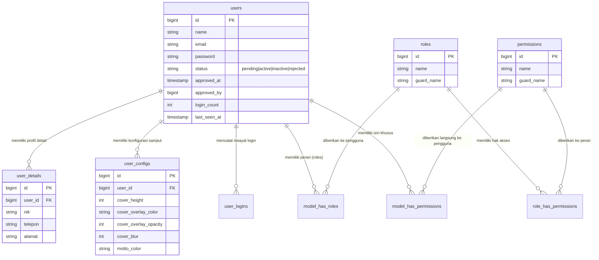
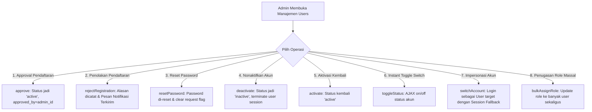

# 👥 Dokumentasi Arsitektur & Operasional Modul Manajemen Pengguna

> **Status Modul:** Production-Ready (Enterprise Grade Modular Architecture)  
> **Lokasi File Dokumentasi:** `docs/arsitektur_dan_operasional_manajemen_pengguna.md`  
> **Prefix Route:** `/admin/manajemenpengguna/*`  
> **Aset Terpisah (Rule 15):** `public/assets/css/admin/manajemenpengguna/*.css` & `public/assets/js/admin/manajemenpengguna/*.js`  
> **Terakhir Diperbarui:** 04 September 2026 09:22 WIB  

---

## 📋 1. Pendahuluan & Ringkasan Modul

Modul **Manajemen Pengguna** (*User & Access Control Management Hub*) pada REPALOGIC Dashboard merupakan pusat otorisasi, autentikasi, manajemen siklus hidup akun pengguna, serta audit keamanan login berbasis **Spatie Laravel-Permission**.

Modul ini terdiri dari **6 Sub-Modul Terintegrasi**:

```
┌─────────────────────────────────────────────────────────────────────────────────────────────┐
│                            HUB SENTRAL MANAJEMEN PENGGUNA                                   │
├──────────────────────────────┬──────────────────────────────┬───────────────────────────────┤
│ 1. Role (Peran Pengguna)     │ 2. Permission (Izin Akses)   │ 3. Akses Role (Role Matrix)   │
│ - Hierarki Role & Guard Web  │ - CRUD Action Binding        │ - Permission Matrix Table     │
│ - Proteksi Lock Superadmin   │ - Grouping Modul Target      │ - Sync Permission per Role    │
├──────────────────────────────┼──────────────────────────────┼───────────────────────────────┤
│ 4. Akses User (User Matrix)  │ 5. Users (Manajemen Akun)    │ 6. Data Login (Audit Trail)   │
│ - Direct User Permissions    │ - Approval & Deactivation    │ - IP, Device, OS, Browser     │
│ - Multi-Role Assignment      │ - Impersonation & Bulk Role  │ - Geolocation Map & Points    │
└──────────────────────────────┴──────────────────────────────┴───────────────────────────────┘
```

---

## 🏛️ 2. Arsitektur Database & Skema Relasi Otorisasi (ERD)

Sistem mengombinasikan tabel pengguna aplikasi (`users`, `user_details`, `user_configs`, `user_logins`) dengan tabel standar ekosistem Spatie Permission (`roles`, `permissions`, `model_has_roles`, `role_has_permissions`, `model_has_permissions`).

### 2.1 Skema Tabel Inti

| Tabel | Keterangan & Peranan |
| :--- | :--- |
| `users` | Entitas akun pengguna, autentikasi password, status verifikasi (`pending`, `active`, `inactive`, `rejected`), poin login, dan status approval. |
| `user_details` | Data profil pelengkap (NIK, pekerjaan, nomor telepon WhatsApp, domisili kabupaten/kota, foto KTP). |
| `user_configs` | Konfigurasi visual profil (tinggi sampul banner, warna overlay, opacity, blur, warna teks motto). |
| `user_logins` | Audit trail riwayat login, IP address, user-agent, sistem operasi, browser, koordinat latitude/longitude, dan reward poin login. |
| `roles` | Tabel peran Spatie (`superadmin`, `admin`, `operator`, `user`, dll) dengan `guard_name = 'web'`. |
| `permissions` | Tabel izin akses spesifik (format: `{action} {kelompok}/{modul}`). |
| `role_has_permissions` | Pivot relasi many-to-many antara Role dan Permission. |
| `model_has_roles` | Pivot relasi penugasan satu atau banyak Role kepada User. |
| `model_has_permissions` | Pivot relasi izin langsung (*direct permission*) tingkat individual kepada User. |

### 2.2 Diagram Relasi Entitas (Mermaid ERD)



---

## ⚙️ 3. Rincian Arsitektur 6 Sub-Modul

---

### 👑 3.1 Sub-Modul 1: Role (`RoleController`)
- **Route URL:** `/admin/manajemenpengguna/role`
- **Controller:** [`App\Http\Controllers\Admin\ManajemenPengguna\RoleController`](../app/Http/Controllers/Admin/ManajemenPengguna/RoleController.php)
- **Aset Terpisah:** `public/assets/css/admin/manajemenpengguna/role.css` & `public/assets/js/admin/manajemenpengguna/role.js`
- **Fungsi Utama:**
  1. Menampilkan daftar seluruh Role dengan penghitungan otomatis jumlah pengguna (`users_count`) dan jumlah hak akses terpasang (`permissions_count`).
  2. Pembuatan Role baru dan penugasan permissions awal secara serentak.
  3. **Proteksi Kunci Superadmin:** Role `superadmin` dilindungi dari aksi penghapusan (*delete locked*).
  4. Pembersihan otomatis cache Spatie (`PermissionRegistrar::forgetCachedPermissions()`) pada setiap operasi CRUD.

---

### 🔑 3.2 Sub-Modul 2: Permission (`PermissionController`)
- **Route URL:** `/admin/manajemenpengguna/permission`
- **Controller:** [`App\Http\Controllers\Admin\ManajemenPengguna\PermissionController`](../app/Http/Controllers/Admin/ManajemenPengguna/PermissionController.php)
- **Aset Terpisah:** `public/assets/css/admin/manajemenpengguna/permission.css` & `public/assets/js/admin/manajemenpengguna/permission.js`
- **Fungsi Utama:**
  1. **Pengelompokan Otomatis Berdasarkan Modul Target:** Sistem mengelompokkan permission berdasarkan target fitur (misal: `dukunganaplikasi/menu`, `manajemenpengguna/user`).
  2. **Dukungan Aksi CRUD Baku:** `create`, `read`, `update`, `delete` dengan lencana warna kontras standar.
  3. **Dual Mode View & AJAX DataTables:** Mendukung pencarian server-side dan modal detail perizinan.

---

### 🛡️ 3.3 Sub-Modul 3: Akses Role (`AksesRoleController`)
- **Route URL:** `/admin/manajemenpengguna/akses-role`
- **Controller:** [`App\Http\Controllers\Admin\ManajemenPengguna\AksesRoleController`](../app/Http/Controllers/Admin/ManajemenPengguna/AksesRoleController.php)
- **Aset Terpisah:** `public/assets/css/admin/manajemenpengguna/akses-role.css` & `public/assets/js/admin/manajemenpengguna/akses-role.js`
- **Fungsi Utama:**
  1. **Tabel Matriks Permission Berjenjang (*Matrix Table*):**
     - Kolom: `MODUL / FITUR`, `CREATE`, `READ`, `UPDATE`, `DELETE`, `SEMUA`.
     - Dikelompokkan rapi berdasarkan Menu Utama & Sub-Menu.
  2. **Master Select All Header:** Checkbox di bagian atas untuk mencentang seluruh permission dalam satu kali klik.
  3. **Per-Row Toggle:** Kolom *SEMUA* untuk mencentang seluruh aksi CRUD khusus pada baris modul tersebut.
  4. **Pembersihan Hak Akses Seketika (*Clear Permissions*):** Mengosongkan seluruh permission suatu role dengan konfirmasi SweetAlert2 (kecuali Superadmin).

---

### 👤 3.4 Sub-Modul 4: Akses User (`AksesUserController`)
- **Route URL:** `/admin/manajemenpengguna/akses-user`
- **Controller:** [`App\Http\Controllers\Admin\ManajemenPengguna\AksesUserController`](../app/Http/Controllers/Admin/ManajemenPengguna/AksesUserController.php)
- **Aset Terpisah:** `public/assets/css/admin/manajemenpengguna/akses-user.css` & `public/assets/js/admin/manajemenpengguna/akses-user.js`
- **Fungsi Utama:**
  1. **Penugasan Multi-Role & Izin Khusus (*Direct Permissions*):** Memberikan izin spesifik kepada pengguna tertentu di luar batas hak akses Role yang dimilikinya.
  2. **Penyaringan Otomatis (*Diff Redundancy Filtering*):**
     ```php
     // Ambil permission bawaan dari role yang dipilih
     $rolePermissionNames = Role::whereIn('name', $selectedRoles)
         ->with('permissions')
         ->get()
         ->flatMap(fn($role) => $role->permissions->pluck('name'))
         ->unique()->toArray();

     // Hanya simpan izin langsung yang belum tercakup oleh role
     $directPermissions = array_values(array_diff($submittedPermissions, $rolePermissionNames));
     $user->syncPermissions($directPermissions);
     ```
  3. **Visualisasi Izin Efektif:** Tampilan membedakan antara izin yang diwarisi dari Role (*Role-inherited*) dan izin tambahan khusus (*Direct user-assigned*).

---

### 🧑‍💼 3.5 Sub-Modul 5: Users (`UserController`)
- **Route URL:** `/admin/manajemenpengguna/users`
- **Controller:** [`App\Http\Controllers\Admin\ManajemenPengguna\UserController`](../app/Http/Controllers/Admin/ManajemenPengguna/UserController.php)
- **Aset Terpisah:** `public/assets/css/admin/manajemenpengguna/users.css` & `public/assets/js/admin/manajemenpengguna/users.js`
- **Fungsi & Alur Operasional:**



#### Fitur Khusus:
- **Impersonasi Akun (*Account Switcher*):** Administrator dapat masuk ke dalam dashboard sebagai pengguna target untuk membantu pemecahan masalah tanpa mengetahui password pengguna. Tombol melayang (*floating badge*) **"Kembali ke Akun Admin"** disematkan di bagian atas layar untuk kembali ke sesi administrator asal.
- **Penugasan Role Massal (*Bulk Assign Roles*):** Mengubah peran banyak pengguna yang dipilih melalui checkbox tabel secara serentak.

---

### 📊 3.6 Sub-Modul 6: Data Login (`DataLoginController`)
- **Route URL:** `/admin/manajemenpengguna/data-login`
- **Controller:** [`App\Http\Controllers\Admin\ManajemenPengguna\DataLoginController`](../app/Http/Controllers/Admin/ManajemenPengguna/DataLoginController.php)
- **Aset Terpisah:** `public/assets/css/admin/manajemenpengguna/data-login.css` & `public/assets/js/admin/manajemenpengguna/data-login.js`
- **Fungsi Utama:**
  1. **Tab 1 - Pengguna yang Login Hari Ini:** Menampilkan daftar unik pengguna yang aktif hari ini, status online real-time, waktu login pertama & terakhir, total sesi, serta reward poin harian.
  2. **Tab 2 - Riwayat Lengkap & Audit Trail:** Seluruh log autentikasi lengkap dengan filter:
     - Rentang waktu: *Hari ini, 7 Hari Terakhir, Bulan Ini, Kustom Kalender*.
     - Filter per pengguna spesifik & pencarian bebas (IP/Device).
     - Filter status kehadiran (*Online / Offline*).
  3. **Peta Geolokasi Interaktif (OpenStreetMap Embed):** Modal detail menampilkan titik koordinat latitude dan longitude lokasi saat pengguna melakukan autentikasi.
  4. **Pembersihan Log Berkala (*Maintenance Purge*):** Endpoint `POST /admin/manajemenpengguna/data-login/clear` untuk membersihkan riwayat login lama di atas $N$ hari demi optimasi ukuran database.

---

## 🌐 4. Daftar Rute & Endpoint Lengkap

| HTTP Method | Route URI | Nama Route | Sub-Modul |
| :--- | :--- | :--- | :--- |
| `GET` | `/admin/manajemenpengguna/role` | `admin.manajemenpengguna.role.index` | Role |
| `POST` | `/admin/manajemenpengguna/role` | `admin.manajemenpengguna.role.store` | Role |
| `PUT` | `/admin/manajemenpengguna/role/{id}` | `admin.manajemenpengguna.role.update` | Role |
| `DELETE` | `/admin/manajemenpengguna/role/{id}` | `admin.manajemenpengguna.role.destroy` | Role |
| `GET` | `/admin/manajemenpengguna/permission` | `admin.manajemenpengguna.permission.index` | Permission |
| `POST` | `/admin/manajemenpengguna/permission` | `admin.manajemenpengguna.permission.store` | Permission |
| `DELETE` | `/admin/manajemenpengguna/permission/{id}` | `admin.manajemenpengguna.permission.destroy` | Permission |
| `GET` | `/admin/manajemenpengguna/akses-role` | `admin.manajemenpengguna.akses-role.index` | Akses Role |
| `PUT` | `/admin/manajemenpengguna/akses-role/{id}` | `admin.manajemenpengguna.akses-role.update` | Akses Role |
| `DELETE` | `/admin/manajemenpengguna/akses-role/{id}` | `admin.manajemenpengguna.akses-role.destroy` | Akses Role |
| `GET` | `/admin/manajemenpengguna/akses-user` | `admin.manajemenpengguna.akses-user.index` | Akses User |
| `PUT` | `/admin/manajemenpengguna/akses-user/{id}` | `admin.manajemenpengguna.akses-user.update` | Akses User |
| `DELETE` | `/admin/manajemenpengguna/akses-user/{id}` | `admin.manajemenpengguna.akses-user.destroy` | Akses User |
| `GET` | `/admin/manajemenpengguna/users` | `admin.manajemenpengguna.users.index` | Users |
| `POST` | `/admin/manajemenpengguna/users` | `admin.manajemenpengguna.users.store` | Users |
| `PUT` | `/admin/manajemenpengguna/users/{id}` | `admin.manajemenpengguna.users.update` | Users |
| `DELETE` | `/admin/manajemenpengguna/users/{id}` | `admin.manajemenpengguna.users.destroy` | Users |
| `POST` | `/admin/manajemenpengguna/users/{id}/approve` | `admin.manajemenpengguna.users.approve` | Users (Approval) |
| `POST` | `/admin/manajemenpengguna/users/{id}/reject-registration` | `admin.manajemenpengguna.users.reject-registration` | Users (Tolak Daftar) |
| `POST` | `/admin/manajemenpengguna/users/{id}/reset-password` | `admin.manajemenpengguna.users.reset-password` | Users (Reset Sandi) |
| `POST` | `/admin/manajemenpengguna/users/{id}/deactivate` | `admin.manajemenpengguna.users.deactivate` | Users (Nonaktif) |
| `POST` | `/admin/manajemenpengguna/users/{id}/activate` | `admin.manajemenpengguna.users.activate` | Users (Aktivasi) |
| `POST` | `/admin/manajemenpengguna/users/{id}/toggle-status` | `admin.manajemenpengguna.users.toggle-status` | Users (Toggle Status) |
| `POST` | `/admin/manajemenpengguna/users/{id}/switch-account` | `admin.manajemenpengguna.users.switch-account` | Users (Impersonasi) |
| `POST` | `/admin/manajemenpengguna/users/bulk-assign-role` | `admin.manajemenpengguna.users.bulk-assign-role` | Users (Bulk Role) |
| `GET` | `/admin/manajemenpengguna/data-login` | `admin.manajemenpengguna.data-login.index` | Data Login |
| `GET` | `/admin/manajemenpengguna/data-login/{id}` | `admin.manajemenpengguna.data-login.show` | Data Login (Detail JSON) |
| `DELETE` | `/admin/manajemenpengguna/data-login/{id}` | `admin.manajemenpengguna.data-login.destroy` | Data Login |
| `POST` | `/admin/manajemenpengguna/data-login/clear` | `admin.manajemenpengguna.data-login.clear` | Data Login (Purge) |

---

## 🎨 5. Standar Tampilan & Interaksi Pengguna (Rules Compliance)

1. **Aturan 4: Modal Bebas Scroll Internal (`modal-xl` / `modal-lg`)**  
   Modal matriks permission dan form pengguna mengalir secara alami mengikuti scrollbar peramban utama tanpa container sempit.
2. **Aturan 5: Desain Checkbox Kontras Tinggi Matrix Table**  
   Kotak centang matriks Spatie menggunakan border tegas (`border: 2px solid #475569 !important`) dengan ukuran proporsional `1.25em`.
3. **Aturan 8: Format Header Tabel Single-Line & Rata Tengah**  
   Semua header tabel pada 6 sub-modul menerapkan `align-middle text-center text-nowrap`.
4. **Aturan 9: Universal SweetAlert2 Helpers**  
   Aksi hapus, konfirmasi reset sandi, dan persetujuan akun terhubung ke helper global `window.showConfirm()`, `window.showSuccess()`, dan `window.showError()`.
5. **Aturan 15: Pemisahan Aset Eksternal CSS & JS**  
   Seluruh script dan style disimpan terpisah pada `public/assets/css/admin/manajemenpengguna/` dan `public/assets/js/admin/manajemenpengguna/`.

---

## 📑 6. Panduan Operasional & Pemecahan Masalah (Troubleshooting)

### 6.1 Panduan Langkah Demi Langkah

#### A. Membuat Role & Menetapkan Hak Akses Matriks:
1. Buka **Manajemen Pengguna > Role**.
2. Klik tombol **Tambah Role Baru**, isi nama role (misal: `operator`), dan pilih permission yang diinginkan pada matriks tabel.
3. Klik **Simpan Role**.
4. Untuk menyempurnakan hak akses di kemudian hari, buka **Manajemen Pengguna > Akses Role**, pilih role target, centang/uncheck modul, dan klik **Simpan Hak Akses**.

#### B. Memberikan Hak Akses Khusus ke Satu Pengguna (*Direct User Permission*):
1. Buka **Manajemen Pengguna > Akses User**.
2. Cari pengguna yang bersangkutan dan klik tombol **Edit Akses**.
3. Centang permission spesifik yang ingin ditambahkan di luar role dasar.
4. Klik **Simpan Akses User**.

#### C. Menggunakan Fitur Impersonasi (*Switch Account*):
1. Buka **Manajemen Pengguna > Users**.
2. Pada baris pengguna yang ingin diuji, klik tombol **Login Sebagai Pengguna** (`ti ti-switch-horizontal`).
3. Konfirmasi modal. Dashboard akan langsung berpindah ke sudut pandang pengguna tersebut.
4. Untuk kembali ke akun Administrator, klik tombol **"Kembali ke Akun Asli"** pada banner notifikasi di bagian atas halaman.

---

### 6.2 Pemecahan Masalah (Troubleshooting)

| Gejala Masalah | Penyebab Umum | Solusi Perbaikan |
| :--- | :--- | :--- |
| **Pengguna baru tidak bisa mengakses menu yang baru diizinkan** | Cache Spatie permission masih menyimpan state lama di Redis/File cache. | Sistem otomatis menjalankan `forgetCachedPermissions()`, namun jika terjadi galat manual, jalankan `php artisan permission:cache-reset` di terminal. |
| **Role Superadmin tidak dapat dihapus** | Terdapat proteksi keamanan sistem agar akun master tidak kehilangan kendali. | Hal ini merupakan perilaku normal (*intended behavior*) untuk menjaga integritas otorisasi sistem. |
| **Peta geolokasi di riwayat login tidak muncul** | Koordinat `latitude` dan `longitude` bernilai null (pengguna menolak izin lokasi peramban). | Peta hanya akan dirender jika peramban pengguna mengizinkan pembagian koordinat saat login. |

---

> 📌 **Dokumentasi ini dikelola secara resmi oleh Tim Pengembang REPALOGIC Dashboard.**  
> *Setiap penambahan permission baru, migrasi skema tabel pengguna, atau rute operasional wajib memperbarui berkas ini.*
