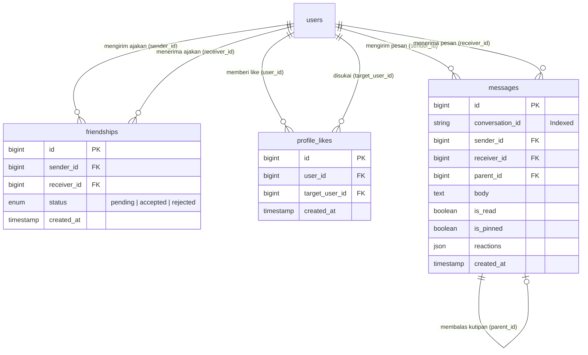
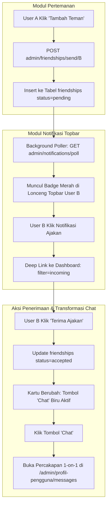

# 🤝 Dokumentasi Arsitektur & Operasional Fitur Pertemanan, Notifikasi & Chat

> **Status Modul:** Production-Ready (Enterprise Grade Modular Architecture)  
> **Lokasi File Dokumentasi:** `docs/arsitektur_dan_operasional_pertemanan_notifikasi_chat.md`  
> **Route URL:**  
> - Pertemanan & Likes: `/admin/friendships/*`  
> - Notifikasi Topbar: `/admin/notifications/*`  
> - Obrolan & Chat: `/admin/profil-pengguna/messages/*`  
> **Aset Terpisah (Rule 15):**  
> - Dashboard Social Hub: [`public/assets/css/admin/dashboard.css`](../public/assets/css/admin/dashboard.css) & [`public/assets/js/admin/dashboard.js`](../public/assets/js/admin/dashboard.js)  
> - Chat & Messages: [`public/assets/css/admin/profil-pengguna/messages.css`](../public/assets/css/admin/profil-pengguna/messages.css) & [`public/assets/js/admin/profil-pengguna/messages.js`](../public/assets/js/admin/profil-pengguna/messages.js)  
> **Terakhir Diperbarui:** 04 September 2026 09:22 WIB  

---

## 📋 1. Pendahuluan & Ringkasan Ekosistem Sosial

Ekosistem sosial internal pada REPALOGIC Dashboard dirancang sebagai **Triad Interaktif Terpadu** yang menggabungkan tiga pilar utama:
1. **Engine Pertemanan & Profil Likes (*Friendships & Social Engine*)**
2. **Pusat Notifikasi & Lonceng Real-Time (*Notification Hub*)**
3. **Pesan Langsung & Obrolan 1-on-1 (*Direct Messaging & Chat Engine*)**

Ketiga modul ini saling terhubung secara reaktif, di mana setiap aksi pertemanan (mengirim ajakan, menerima pertemanan, memberi like) langsung memicu notifikasi topbar secara instan dan mengubah status interaksi pada antarmuka chat.

```
┌─────────────────────────────────────────────────────────────────────────────────────────────┐
│                       TRIAD INTERAKTIF: PERTEMANAN ⇄ NOTIFIKASI ⇄ CHAT                      │
├──────────────────────────────┬──────────────────────────────┬───────────────────────────────┤
│ 1. Engine Pertemanan & Like  │ 2. Pusat Notifikasi Topbar   │ 3. Direct Messaging & Chat    │
│ - Ajakan Berteman (Pending)  │ - Lonceng Notifikasi Latar   │ - Obrolan 1-on-1 Real-Time    │
│ - Penerimaan / Penolakan     │ - Filter & Deep Linking      │ - Quoted Reply & Reactions    │
│ - Like Profil Pengguna       │ - Polling Otomatis (Bell)    │ - 3-Dots Dropdown & Voice Note│
│ - Mutasi Kartu Dinamis       │ - Intersepsi Dashboard Live  │ - Unread Badge Counter        │
└──────────────────────────────┴──────────────────────────────┴───────────────────────────────┘
```

---

## 🏛️ 2. Arsitektur Database & Skema Relasi

Ekosistem ini ditopang oleh 4 tabel utama: `friendships`, `profile_likes`, `messages`, dan `notifications`.

### 2.1 Skema Tabel `friendships`

| Kolom | Tipe Data | Keterangan & Atribut |
| :--- | :--- | :--- |
| `id` | `BIGINT UNSIGNED` | Primary Key, Auto Increment |
| `sender_id` | `BIGINT UNSIGNED` | Foreign Key ke `users.id` (Pengirim ajakan berteman) |
| `receiver_id` | `BIGINT UNSIGNED` | Foreign Key ke `users.id` (Penerima ajakan berteman) |
| `status` | `ENUM('pending', 'accepted', 'rejected')` | Default `'pending'`, status relasi pertemanan |
| `created_at` / `updated_at` | `TIMESTAMP` | Timestamps Eloquent |

### 2.2 Skema Tabel `profile_likes`

| Kolom | Tipe Data | Keterangan & Atribut |
| :--- | :--- | :--- |
| `id` | `BIGINT UNSIGNED` | Primary Key, Auto Increment |
| `user_id` | `BIGINT UNSIGNED` | Foreign Key ke `users.id` (Pemberi like) |
| `target_user_id` | `BIGINT UNSIGNED` | Foreign Key ke `users.id` (Pemilik profil yang disukai) |
| `created_at` / `updated_at` | `TIMESTAMP` | Timestamps Eloquent |

### 2.3 Skema Tabel `messages`

| Kolom | Tipe Data | Keterangan & Atribut |
| :--- | :--- | :--- |
| `id` | `BIGINT UNSIGNED` | Primary Key, Auto Increment |
| `conversation_id` | `VARCHAR(100)` | Indeks deterministik percakapan (`{min_id}_{max_id}`) |
| `sender_id` | `BIGINT UNSIGNED` | Foreign Key ke `users.id` |
| `receiver_id` | `BIGINT UNSIGNED` | Foreign Key ke `users.id` |
| `parent_id` | `BIGINT UNSIGNED` | Nullable, Foreign Key ke `messages.id` (Quoted reply) |
| `subject` | `VARCHAR(255)` | Subjek atau konteks pesan |
| `body` | `TEXT` | Isi pesan obrolan |
| `attachment_url` | `VARCHAR(255)` | Nullable, URL berkas lampiran |
| `attachment_type`| `VARCHAR(50)`  | Nullable (`image`, `voice`, `file`) |
| `is_read` | `BOOLEAN` | Default `false`, penanda pesan terbaca |
| `is_pinned` | `BOOLEAN` | Default `false`, penanda disematkan |
| `reactions` | `JSON` | Nullable, emoji array |
| `is_forwarded` | `BOOLEAN` | Default `false` |
| `deleted_for_sender` | `BOOLEAN` | Default `false` |
| `deleted_for_receiver`| `BOOLEAN` | Default `false` |
| `read_at` | `TIMESTAMP` | Nullable, waktu presisi pesan dibaca |

### 2.4 Diagram Relasi Entitas (Mermaid ERD)



---

## 🔄 3. Keterkaitan Pertemanan dengan Notifikasi & Chat

Hubungan ketiga modul saling melengkapi dan bereaksi terhadap perubahan status di database:



### 3.1 Alur Notifikasi Ajakan Berteman Masuk
1. Ketika **User A** mengirimkan ajakan berteman ke **User B**, data tersimpan di tabel `friendships` dengan `status = 'pending'`.
2. Servis [`NotificationService::getNotifications()`](../app/Services/NotificationService.php) mendeteksi ajakan masuk untuk User B.
3. Poller topbar (`GET /admin/notifications/poll`) merender item notifikasi ber-badge `Ajakan Berteman` dengan tautan deep link:  
   `route('dashboard', ['contact_search' => $sender->name, 'filter' => 'incoming'])`.
4. Jika User B sedang berada di halaman Dashboard, klik pada notifikasi akan **diintersepsi secara mulus** oleh JavaScript:
   - Filter kartu otomatis beralih ke tab **Ajakan Masuk (`incoming`)**.
   - Input pencarian otomatis terisi nama User A dan kartu digulir (*smooth scroll*) ke tengah layar.

### 3.2 Transformasi Kartu Kontak Menuju Jalur Chat
1. Sebelum berteman, kartu kontak menampilkan tombol **`+ Tambah Teman`** dan ikon pesan kecil.
2. Setelah ajakan diterima (`status = 'accepted'`), UI kartu kontak bermutasi:
   - Tombol utama berubah menjadi tombol **`💬 Chat`** berwarna biru primer.
   - Menekan tombol **`💬 Chat`** langsung mengarahkan pengguna ke `/admin/profil-pengguna/messages?user_id={id}` dengan jendela percakapan terbuka seketika.
   - Tombol sekunder menyediakan dropdown **`Teman`** untuk opsi **Hapus Pertemanan (*Unfriend*)**.

---

## ⚙️ 4. Arsitektur Backend & Daftar Endpoint API

### 4.1 Endpoint Pertemanan & Likes (`FriendshipController`)

| HTTP Method | Route URI | Nama Route | Fungsi & Deskripsi |
| :---: | :--- | :--- | :--- |
| `GET` | `/admin/friendships/poll-dashboard` | `admin.friendships.poll-dashboard` | Poller multi-data untuk status pertemanan, like counts, online presence, dan profil kontak. |
| `POST` | `/admin/friendships/toggle-like/{user}` | `admin.friendships.toggle-like` | Memberi atau membatalkan like pada profil pengguna lain. |
| `POST` | `/admin/friendships/send/{user}` | `admin.friendships.send` | Mengirimkan ajakan berteman baru. |
| `POST` | `/admin/friendships/accept/{id}` | `admin.friendships.accept` | Menerima ajakan berteman masuk. |
| `POST` | `/admin/friendships/reject/{id}` | `admin.friendships.reject` | Menolak ajakan berteman masuk. |
| `POST` | `/admin/friendships/cancel/{user}` | `admin.friendships.cancel` | Membatalkan ajakan berteman yang sedang pending terkirim. |
| `DELETE` | `/admin/friendships/unfriend/{user}` | `admin.friendships.unfriend` | Menghapus status pertemanan (*unfriend*). |

### 4.2 Endpoint Notifikasi (`NotificationController`)

| HTTP Method | Route URI | Nama Route | Fungsi & Deskripsi |
| :---: | :--- | :--- | :--- |
| `GET` | `/admin/notifications/poll` | `admin.notifications.poll` | Poller topbar lonceng untuk ajakan berteman & notifikasi administratif. |
| `GET` | `/admin/notifications/poll-messages` | `admin.notifications.poll-messages` | Poller topbar amplop pesan untuk unread counter chat per pengirim. |
| `POST` | `/admin/notifications/{id}/read` | `admin.notifications.mark-as-read` | Menandai notifikasi / pesan sebagai telah dibaca. |

### 4.3 Endpoint Obrolan & Chat (`MessageController`)

| HTTP Method | Route URI | Nama Route | Fungsi & Deskripsi |
| :---: | :--- | :--- | :--- |
| `GET` | `/admin/profil-pengguna/messages` | `admin.profil-pengguna.messages.index` | Halaman chat utama dengan daftar kontak dan histori obrolan. |
| `GET` | `/admin/profil-pengguna/messages/poll-contacts` | `admin.profil-pengguna.messages.poll-contacts` | Poller sidebar kontak chat untuk status online dan pesan terakhir. |
| `GET` | `/admin/profil-pengguna/messages/conversation/{user}` | `admin.profil-pengguna.messages.conversation` | Mengambil pesan obrolan aktif secara real-time. |
| `POST` | `/admin/profil-pengguna/messages/send` | `admin.profil-pengguna.messages.send` | Mengirimkan pesan teks, quoted reply, voice note, dan lampiran. |
| `POST` | `/admin/profil-pengguna/messages/{id}/toggle-pin` | `admin.profil-pengguna.messages.toggle-pin` | Menyematkan / melepas pin pesan obrolan. |
| `POST` | `/admin/profil-pengguna/messages/{id}/toggle-reaction` | `admin.profil-pengguna.messages.toggle-reaction` | Toggle reaksi emoji pada pesan obrolan. |
| `POST` | `/admin/profil-pengguna/messages/{id}/forward` | `admin.profil-pengguna.messages.forward` | Meneruskan pesan ke kontak lain. |
| `PUT` | `/admin/profil-pengguna/messages/{id}` | `admin.profil-pengguna.messages.update` | Mengedit pesan teks yang telah dikirim (batas 10 menit sejak dikirim, dengan label diedit). |
| `DELETE` | `/admin/profil-pengguna/messages/{id}` | `admin.profil-pengguna.messages.destroy` | Menghapus pesan (unsend untuk semua orang atau hapus lokal). |
| `DELETE` | `/admin/profil-pengguna/messages/conversation/{user}/clear` | `admin.profil-pengguna.messages.clear-conversation` | Membersihkan riwayat percakapan. |

---

## ⏱️ 5. Polling Engine Real-Time & Sinkronisasi Latar Belakang

Sistem menggunakan arsitektur polling multi-interval yang ringan dan efisien tanpa perlu setup WebSocket server eksternal:

```
┌─────────────────────────────────────────────────────────────────────────────────────────┐
│                           QUAD-POLLING ARCHITECTURE ENGINE                              │
├──────────────────────────┬─────────────────────────────┬────────────────────────────────┤
│ Poller 1: Dashboard Hub  │ GET admin/friendships/      │ Interval: 3.5 Detik            │
│                          │ poll-dashboard              │ Target: Status Teman, Likes,   │
│                          │                             │ Banner, Avatar, Online Presence│
├──────────────────────────┼─────────────────────────────┼────────────────────────────────┤
│ Poller 2: Notifikasi     │ GET admin/notifications/    │ Interval: 10 - 20 Detik        │
│           Lonceng        │ poll                        │ Target: Lonceng Topbar, Ajakan │
│                          │                             │ Berteman Masuk, Approval Akun  │
├──────────────────────────┼─────────────────────────────┼────────────────────────────────┤
│ Poller 3: Topbar Amplop  │ GET admin/notifications/    │ Interval: 10 - 20 Detik        │
│           Pesan          │ poll-messages               │ Target: Unread Counter Pesan,  │
│                          │                             │ Grouping Chat per Pengirim     │
├──────────────────────────┼─────────────────────────────┼────────────────────────────────┤
│ Poller 4: Obrolan Aktif  │ GET admin/profil-pengguna/  │ Interval: 2.5 - 3.5 Detik      │
│           (Halaman Chat) │ messages/conversation/{id}  │ Target: Bubble Chat Baru,      │
│                          │                             │ Quoted Replies, In-Place Sync  │
└──────────────────────────┴─────────────────────────────┴────────────────────────────────┘
```

---

## 🎨 6. Arsitektur Frontend & Logika Interaksi

### 6.1 Mutasi DOM Berbasis Event Delegation (Rule 2 Compliance)
Seluruh aksi klik tombol like, kirim ajakan, terima, tolak, batalkan, dan unfriend dikendalikan melalui satu *Event Listener* di level dokumen dalam [`public/assets/js/admin/dashboard.js`](../public/assets/js/admin/dashboard.js):

```javascript
document.addEventListener('click', async function (e) {
    // 1. Toggle Like Profil
    const btnLike = e.target.closest('.btn-like-profile');
    // 2. Kirim Ajakan Berteman
    const btnAddFriend = e.target.closest('.btn-add-friend-action');
    // 3. Batalkan Ajakan Berteman
    const btnCancelFriend = e.target.closest('.btn-cancel-friend-action');
    // 4. Terima Ajakan Berteman
    const btnAcceptFriend = e.target.closest('.btn-accept-friend-action');
    // 5. Tolak Ajakan Berteman
    const btnRejectFriend = e.target.closest('.btn-reject-friend-action');
    // 6. Hapus Pertemanan (Unfriend)
    const btnUnfriend = e.target.closest('.btn-unfriend-action');
});
```

### 6.2 Filter Cerdas & Perankingan Kartu Kontak
Kartu pengguna pada dashboard diurutkan secara otomatis berdasarkan prioritas:
1. **Akun Sendiri** (Paling awal, berlabel `Anda`)
2. **Teman & Sedang Online** (Status online dengan badge hijau berdenyut)
3. **Teman & Sedang Offline**
4. **Bukan Teman & Sedang Online**
5. **Bukan Teman & Sedang Offline**

---

## 📑 7. Panduan Operasional & Pemecahan Masalah (Troubleshooting)

### 7.1 Panduan Langkah Demi Langkah

#### A. Mengirim Ajakan Berteman:
1. Buka halaman **Dashboard Utama**.
2. Cari pengguna target melalui filter tab atau kotak pencarian.
3. Klik tombol **`+ Tambah Teman`**.
4. Tombol seketika berubah menjadi **`Menunggu Respon (Batal)`**.
5. Pengguna target akan langsung menerima notifikasi lonceng di akun mereka.

#### B. Menerima Ajakan & Memulai Chat:
1. Klik lonceng notifikasi pada topbar yang menampilkan badge merah ajakan.
2. Klik item ajakan untuk langsung menuju kartu pengguna pengirim.
3. Klik tombol **`Terima`**.
4. Kartu akan langsung berubah menampilkan tombol **`💬 Chat`**.
5. Klik **`💬 Chat`** untuk langsung bertukar pesan real-time!

#### C. Memberi Like Profil:
1. Klik tombol hati **`❤️`** di sudut kanan atas foto sampul kartu pengguna.
2. Angka total suka akan bertambah secara real-time dan tersinkronisasi ke seluruh sesi pengguna lain.

---

### 7.2 Pemecahan Masalah (Troubleshooting)

| Gejala Masalah | Penyebab Umum | Solusi Perbaikan |
| :--- | :--- | :--- |
| **Notifikasi ajakan berteman tidak muncul di lonceng** | Cache aplikasi aktif atau interval polling belum berjalan. | Pastikan tabel `friendships` memiliki baris status `pending` dan refresh halaman. Periksa pengaturan interval polling di Fitur Aplikasi. |
| **Tombol Chat tidak membuka percakapan target** | Parameter `user_id` tidak terikat pada URL rute. | Pastikan tombol chat mengarah ke `route('admin.profil-pengguna.messages.index', ['user_id' => $user->id])`. |
| **Status online tidak terbarui** | Nilai `last_seen_at` pada tabel `users` belum di-touch oleh middleware sesi aktif. | Pastikan pengguna melakukan aktivitas HTTP normal yang tercatat di session handler. |

---

> 📌 **Dokumentasi ini dikelola secara resmi oleh Tim Pengembang REPALOGIC Dashboard.**  
> *Setiap pembaruan skema database `friendships`, endpoint notifikasi, atau alur UI wajib memperbarui berkas ini.*
