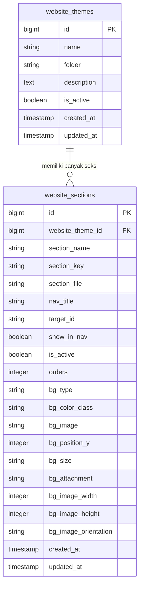
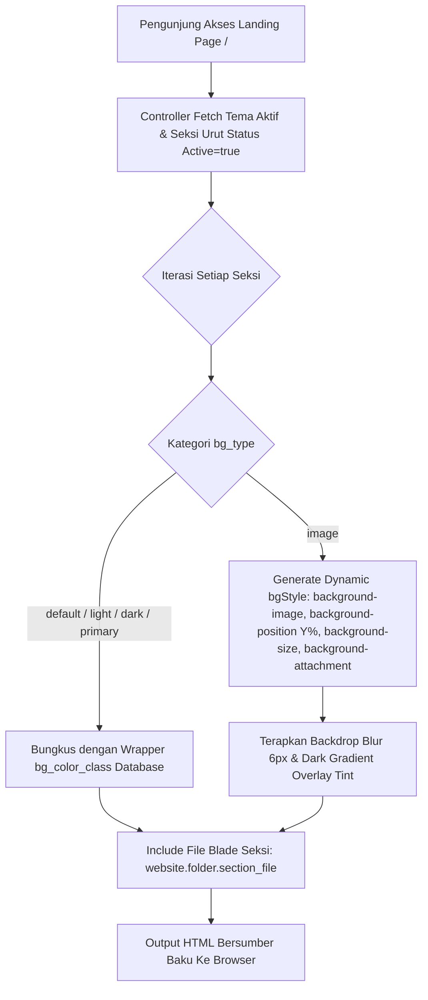

# 🎨 Dokumentasi Arsitektur Engine Dinamisasi Tema & Seksi Website

> **Status Sistem:** Production-Ready (Enterprise Grade Modular Architecture)  
> **Lokasi File Dokumentasi:** `docs/arsitektur_dinamisasi_tema_website.md`  
> **Aplikasi:** REPALOGIC Dashboard  
> **Route URL:** `/admin/dukunganaplikasi/konfigurasi-website`  
> **Controller:** [`App\Http\Controllers\Admin\DukunganAplikasi\KonfigurasiWebsiteController`](../app/Http/Controllers/Admin/DukunganAplikasi/KonfigurasiWebsiteController.php)  
> **Aset Terpisah (Rule 15):** [`public/assets/css/admin/dukunganaplikasi/konfigurasi-website.css`](../public/assets/css/admin/dukunganaplikasi/konfigurasi-website.css) & [`public/assets/js/admin/dukunganaplikasi/konfigurasi-website.js`](../public/assets/js/admin/dukunganaplikasi/konfigurasi-website.js)  
> **Terakhir Diperbarui:** 04 September 2026 09:22 WIB  

---

## 📋 1. Pendahuluan & Ringkasan Eksekutif

Sistem **Engine Dinamisasi Tema & Seksi Website** adalah modul pengelola tata letak dan tema halaman depan (*landing page*) yang dirancang dengan prinsip **Loose Coupling (Pemisahan Tanggung Jawab yang Ketat)**. 

Melalui arsitektur ini, seluruh komponen tampilan publik dipisahkan secara sempurna antara **konten visual HTML (Blade Views)** dengan **properti gaya latar belakang/layout (Database State)**. Pengembang dapat membuat seksi halaman baru dengan kode Blade yang murni dan netral, sementara administrator dapat mengubah variasi warna, gambar latar, fokus potongan gambar, hingga efek paralaks 3D secara dinamis melalui Panel Admin tanpa menyentuh baris kode satu pun.

---

## 🏛️ 2. Prinsip Utama & Standar Pengembangan (Desain Seksi Baku)

Agar seksi halaman dapat beradaptasi secara otomatis terhadap perubahan latar belakang (terang, gelap, warna utama, maupun gambar kustom), setiap file seksi Blade di dalam `resources/views/website/[folder]/` wajib mematuhi **3 Standar Baku**:

### 2.1 Tag Pembuka Seksi Baku (Outer Container)
File seksi **HANYA** diperbolehkan menggunakan tag pembuka baku tanpa menyertakan class warna atau layout tambahan:
```html
<!-- BENAR: Baku, Netral & Dinamis -->
<section class="section-custom" id="[target_id]">
    <div class="container">
        ...
    </div>
</section>

<!-- SALAH: Terkontaminasi class warna keras / layout kaku -->
<section class="section-custom bg-light py-5 position-relative text-dark" id="[target_id]">
```

### 2.2 Larangan Hardcode Warna pada Judul Utama
Gunakan tag standar `<h2>` dan `<p class="text-muted">`. Engine pembungkus sistem secara otomatis menyesuaikan warna teks judul menjadi putih terang saat seksi berlatar gelap atau gambar, dan menjadi gelap saat seksi berlatar terang.

### 2.3 Pembungkus Kartu Konten (`.card`)
Untuk konten berbentuk *grid/features/services*, gunakan komponen `.card` standar Bootstrap. Sistem secara otomatis menjaga teks di dalam kartu tetap berwarna gelap dengan kontras tinggi sehingga 100% terbaca dengan tajam pada semua tipe latar belakang.

---

## 🗄️ 3. Arsitektur Database & Schema Metadata

Sistem ini didukung oleh dua tabel database utama: `website_themes` dan `website_sections`.



---

## 🔄 4. Alur Kerja & Visualisasi Rendering System

### 4.1 Flowchart Rendering Halaman Depan (`welcome.blade.php`)



---

## 📁 5. Struktur Folder & Pemisahan Partial Modular

Mengikuti standar **Rule 10 & Rule 15 Project Architecture**, seluruh komponen sistem disusun secara rapi dan modular:

```text
repalogic-dashboard/
├── app/
│   ├── Http/
│   │   ├── Controllers/Admin/DukunganAplikasi/
│   │   │   └── KonfigurasiWebsiteController.php
│   │   └── Requests/Admin/DukunganAplikasi/
│   │       └── KonfigurasiWebsiteRequest.php
│   └── Models/Admin/DukunganAplikasi/
│       ├── WebsiteTheme.php
│       └── WebsiteSection.php
├── public/assets/
│   ├── css/admin/dukunganaplikasi/
│   │   └── konfigurasi-website.css             <-- External CSS (Rule 15)
│   └── js/admin/dukunganaplikasi/
│       └── konfigurasi-website.js             <-- External JS AJAX (Rule 15)
├── resources/views/
│   ├── admin/dukunganaplikasi/
│   │   ├── konfigurasi-website.blade.php       <-- Halaman Utama Admin
│   │   └── partials/                           <-- File Partial Modal Modular
│   │       ├── konfigurasi_website_modal_form.blade.php
│   │       ├── konfigurasi_website_modal_petunjuk.blade.php
│   │       ├── konfigurasi_website_modal_tampilgambar.blade.php
│   │       └── konfigurasi_website_modal_script_editor.blade.php  <-- GUI Code Editor Modal
│   ├── website/                                <-- Sub-Directory Tema Blade
│   │   ├── default/                            <-- Seksi Tema Default
│   │   └── partials/
│   │       └── _css.blade.php                  <-- Styling Global & Backdrop Filter Blur
│   └── welcome.blade.php                       <-- Landing Page Renderer Engine
└── docs/
    └── arsitektur_dinamisasi_tema_website.md   <-- [File Ini]
```

### Pemisahan File Partial Modal:
1. **`konfigurasi_website_modal_form.blade.php`**: Mengelola Modal Tambah/Edit Tema dan Modal Tambah/Edit Seksi Halaman.
2. **`konfigurasi_website_modal_petunjuk.blade.php`**: Mengelola Modal Panduan Standarisasi Seksi Tema untuk panduan developer.
3. **`konfigurasi_website_modal_tampilgambar.blade.php`**: Mengelola Modal Pratinjau Gambar Background Interaktif, Simulator Tinggi Seksi, Orientasi, dan Pengaturan Efek.
4. **`konfigurasi_website_modal_script_editor.blade.php`**: Mengelola Modal GUI Code Editor Script Blade langsung dari browser lengkap dengan Ace Code Editor, Snippet Inserter, Fullscreen Mode, Word Wrap, Dark/Light Theme switcher, shortcut `Ctrl + S`, dan auto backup + `view:clear`.

---

> 📌 **Dokumentasi ini dikelola secara resmi oleh Tim Pengembang REPALOGIC Dashboard.**
