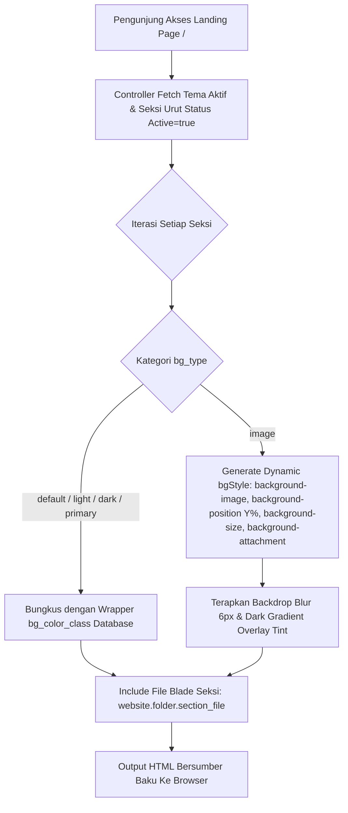

# Dokumentasi Arsitektur Engine Dinamisasi Tema & Seksi Website

> **Status Sistem:** Production-Ready (Enterprise Grade)  
> **Lokasi File Dokumentasi:** `docs/arsitektur_dinamisasi_tema_website.md`  
> **Terakhir Diperbarui:** 27 Agustus 2026  

---

## 📋 1. Pendahuluan & Ringkasan Eksekutif

Sistem **Engine Dinamisasi Tema & Seksi Website** adalah modul pengelola tata letak dan tema halaman depan (*landing page*) yang dirancang dengan prinsip **Loose Coupling (Pemisahan Tanggung Jawab yang Ketat)**. 

Melalui arsitektur ini, seluruh komponen tampilan publik dipisahkan secara sempurna antara **konten visual HTML (Blade Views)** dengan **properti gaya latar belakang/layout (Database State)**. Pengembang dapat membuat seksi halaman baru dengan kode Blade yang murni dan netral, sementara administrator dapat mengubah variasi warna, gambar latar, fokus potongan gambar, hingga efek paralaks 3D secara dinamis melalui Panel Admin tanpa menyentuh baris kode satu pun.

---

## 🏛️ 2. Prinsip Utama & Standar Pengembangan (Desain Seksi Baku)

Agar seksi halaman dapat beradaptasi secara otomatis terhadap perubahan latar belakang (terang, gelap, warna utama, maupun gambar kustom), setiap file seksi Blade di dalam `resources/views/website/[folder]/` wajib mematuhi **3 Standar Baku**:

### 2.1 Tag Pembuka Seksi Baku (Outer Container)
File seksi **HANYA** diperbolehkan menggunakan tag pembuka baku tanpa menyertakan class warna atau layout tambahan:
```html
<!-- BENAR: Baku, Netral & Dinamis -->
<section class="section-custom" id="[target_id]">
    <div class="container">
        ...
    </div>
</section>

<!-- SALAH: Terkontaminasi class warna keras / layout kaku -->
<section class="section-custom bg-light py-5 position-relative text-dark" id="[target_id]">
```

### 2.2 Larangan Hardcode Warna pada Judul Utama
Gunakan tag standar `<h2>` dan `<p class="text-muted">`. Engine pembungkus sistem secara otomatis menyesuaikan warna teks judul menjadi putih terang saat seksi berlatar gelap atau gambar, dan menjadi gelap saat seksi berlatar terang.

### 2.3 Pembungkus Kartu Konten (`.card`)
Untuk konten berbentuk *grid/features/services*, gunakan komponen `.card` standar Bootstrap. Sistem secara otomatis menjaga teks di dalam kartu tetap berwarna gelap dengan kontras tinggi sehingga 100% terbaca dengan tajam pada semua tipe latar belakang.

---

## 🗄️ 3. Arsitektur Database & Schema Metadata

Sistem ini didukung oleh dua tabel database utama: `website_themes` dan `website_sections`.

```mermaid
erDiagram
    website_themes ||--o{ website_sections : "memiliki banyak seksi"
    website_themes {
        bigint id PK
        string name "Nama Identitas Tema"
        string folder "Sub-Directory Blade"
        text description "Deskripsi Singkat"
        boolean is_active "Status Aktif Tema"
        timestamps
    }
    website_sections {
        bigint id PK
        bigint website_theme_id FK
        string section_name "Nama Seksi Halaman"
        string section_key "Unique Key Seksi"
        string section_file "File View Blade"
        string nav_title "Judul di Navbar"
        string target_id "Anchor Target ID (#id)"
        boolean show_in_nav "Tampil di Navbar"
        boolean is_active "Status Aktif Seksi"
        integer orders "Urutan Tampil"
        string bg_type "Gaya Latar (default, light, dark, primary, image)"
        string bg_color_class "Class Warna Ter-generate"
        string bg_image "Path File Gambar Background"
        integer bg_position_y "Posisi Vertikal Gambar (0-100%)"
        string bg_size "Ukuran Latar (cover, contain)"
        string bg_attachment "Efek Scroll (scroll, fixed/paralaks)"
        integer bg_image_width "Lebar Gambar Asli (px)"
        integer bg_image_height "Tinggi Gambar Asli (px)"
        string bg_image_orientation "Orientasi (landscape, portrait, square)"
        timestamps
    }
```

---

## 🔄 4. Alur Kerja & Visualisasi Rendering System

### 4.1 Flowchart Rendering Halaman Depan (`welcome.blade.php`)



---

## 📁 5. Struktur Folder & Pemisahan Partial Modular

Mengikuti standar **Rule 10 Project Architecture**, seluruh komponen sistem disusun secara rapi dan modular:

```text
repalogic-dashboard/
├── app/
│   ├── Http/
│   │   ├── Controllers/Admin/DukunganAplikasi/
│   │   │   └── KonfigurasiWebsiteController.php
│   │   └── Requests/Admin/DukunganAplikasi/
│   │       └── KonfigurasiWebsiteRequest.php
│   └── Models/Admin/DukunganAplikasi/
│       ├── WebsiteTheme.php
│       └── WebsiteSection.php
├── database/
│   └── migrations/
│       ├── 2026_08_27_040000_create_website_themes_table.php
│       ├── 2026_08_27_040100_create_website_sections_table.php
│       ├── 2026_08_27_040200_add_bg_columns_to_website_sections_table.php
│       ├── 2026_08_27_050000_add_bg_position_y_to_website_sections_table.php
│       └── 2026_08_27_060000_add_bg_options_to_website_sections_table.php
├── docs/
│   └── arsitektur_dinamisasi_tema_website.md  <-- [File Ini]
└── resources/views/
    ├── admin/dukunganaplikasi/
    │   ├── konfigurasi-website.blade.php       <-- Halaman Utama Admin
    │   └── partials/                           <-- File Partial Modal Modular
    │       ├── konfigurasi_website_modal_form.blade.php
    │       ├── konfigurasi_website_modal_petunjuk.blade.php
    │       └── konfigurasi_website_modal_tampilgambar.blade.php
    ├── website/                                <-- Sub-Directory Tema Blade
    │   ├── default/                            <-- Seksi Tema Default
    │   └── partials/
    │       └── _css.blade.php                  <-- Styling Global & Backdrop Filter Blur
    └── welcome.blade.php                       <-- Landing Page Renderer Engine
```

### Pemisahan File Partial Modal:
1. **`konfigurasi_website_modal_form.blade.php`**: Mengelola Modal Tambah/Edit Tema dan Modal Tambah/Edit Seksi Halaman. Dibuat bersih dan ringkas tanpa kontrol slider berlebih.
2. **`konfigurasi_website_modal_petunjuk.blade.php`**: Mengelola Modal Panduan Standarisasi Seksi Tema untuk panduan developer.
3. **`konfigurasi_website_modal_tampilgambar.blade.php`**: Mengelola Modal Pratinjau Gambar Background Interaktif, Simulator Tinggi Seksi, Orientasi, dan Pengaturan Efek.

---

## ✨ 6. Fitur Unggulan UX Pengelolaan Media Background

### 6.1 Deteksi Otomatis Orientasi & Dimensi Gambar
Saat gambar diunggah, controller menggunakan PHP `getimagesize()` untuk membaca dimensi gambar asli secara presisi:
- 🖼️ `Landscape`: Jika Lebar > Tinggi (misal `1920×1080px`).
- 📱 `Portrait`: Jika Tinggi > Lebar (misal `1080×1920px`). Menampilkan peringatan tips khusus di modal pratinjau.
- ⏹️ `Square`: Jika Lebar == Tinggi.

### 6.2 Simulator Tinggi Seksi (Height Ratio Simulator)
Di dalam modal pratinjau (`#modal-preview-image`), disediakan **3 Tombol Simulasi**:
- **Pendek (~220px)**: Simulasi potongan seksi tipis seperti *CTA Banner* atau *Newsletter*.
- **Sedang (~380px)**: Simulasi potongan seksi standar seperti *Services* atau *Features*.
- **Tinggi (~550px)**: Simulasi potongan seksi tinggi seperti *Hero Banner*.

### 6.3 Pengaturan Mode Latar & Efek Paralaks 3D
- **Background Size**: Opsi `Cover` (Memenuhi Seksi) atau `Contain` (Tampak Utuh).
- **Background Attachment**: Opsi `Scroll` (Standar) atau `Fixed` (**Efek Paralaks 3D** di mana gambar latar belakang tetap diam saat halaman di-scroll).
- **Soft Dark Backdrop Blur Overlay**: Diatur via CSS (`backdrop-filter: blur(6px)` + `linear-gradient`) untuk memastikan kontras teks utama selalu terjaga tajam dan mudah dibaca.

### 6.4 Pratinjau Gambar Langsung (Live Selection Image Preview)
Pada Modal Tambah & Edit Seksi, memilih file gambar baru via input file akan secara otomatis menampilkan **Pratinjau Gambar Utuh (*Uncropped Contain Display*)** secara real-time menggunakan `URL.createObjectURL` JavaScript sebelum disimpan ke server.

---

## 🛠️ 7. Panduan Pengembang (Developer Guide)

### 7.1 Cara Menambahkan Seksi Halaman Baru
1. Buat file Blade baru di folder `resources/views/website/[folder]/section-namaseksi.blade.php`.
2. Tulis struktur pembuka baku:
   ```html
   <section class="section-custom" id="namaseksi">
       <div class="container">
           <h2>Judul Seksi</h2>
           <p class="text-muted">Deskripsi seksi...</p>
       </div>
   </section>
   ```
3. Buka menu Admin: **Dukungan Aplikasi > Konfigurasi Website**.
4. Klik **Tambah Seksi Halaman**, isi nama file (`section-namaseksi.blade.php`), tentukan target ID (`namaseksi`), dan pilih gaya latar belakang.
5. Klik **Simpan Seksi**. Seksi baru langsung aktif dan tampil di halaman depan!

### 7.2 Cara Menambahkan Tema Website Baru
1. Buat folder sub-directory baru di `resources/views/website/[namatema]/`.
2. Isi folder tersebut dengan file-file seksi Blade bertema khusus.
3. Buka menu Admin: **Dukungan Aplikasi > Konfigurasi Website**.
4. Klik **Tambah Tema Baru**, isi nama tema dan nama folder (`[namatema]`).
5. Aktifkan tema baru. Sistem akan secara otomatis mengalihkan rendering seksi ke folder tema terpilih!

---

## ⚖️ 8. Kepatuhan Aturan & Standar Proyek (Project Rules Checklist)

- [x] **Rule 1 (Vertical Layout & Script Placement)**: Seluruh Script JS diletakkan di dalam `@section('content')` sebelum `@endsection`.
- [x] **Rule 2 (Event Delegation)**: Seluruh tombol aksi tabel dan modal menggunakan *Event Delegation* pada `document.addEventListener('click', ...)`.
- [x] **Rule 7 (Forbidden Custom Dataset `data-target`)**: Atribut custom menggunakan `data-section-id`, `data-target-id`, `data-pos-y`, dsb., untuk menghindari konflik dengan `initCounter()` bawaan theme.
- [x] **Rule 9 (SweetAlert2 Universal Delete/Update Confirmation)**: Menggunakan SweetAlert2 untuk notifikasi pembaruan posisi dan penghapusan seksi.
- [x] **Rule 10 (Flat View Naming & Partial Hierarchy)**: Partial modal dipisah ke `admin/dukunganaplikasi/partials/konfigurasi_website_modal_*.blade.php`.
- [x] **Rule 13 (Website Dynamic Theme View Standard)**: Seluruh tampilan seksi menggunakan pembungkus baku `.section-custom` tanpa hardcode background warna atau gambar di dalam view Blade.

---
*Dokumentasi ini dibuat secara otomatis sebagai panduan resmi pengembangan dan pemeliharaan sistem.*
